# 生命科学论文管理数据库系统 - 架构设计方案

**文档版本**：v2.0  
**创建时间**：2026-03-11  
**最后更新**：2026-03-11  
**状态**：已更新（Golang + SQLite 版本）

---

## 目录

1. [系统架构概述](#1-系统架构概述)
2. [技术架构设计](#2-技术架构设计)
3. [核心模块设计](#3-核心模块设计)
4. [接口设计](#4-接口设计)
5. [安全设计](#5-安全设计)
6. [部署架构](#6-部署架构)
7. [C4 架构模型](#7-c4-架构模型)
8. [架构决策记录 (ADR)](#8-架构决策记录-adr)

---

## 1. 系统架构概述

### 1.1 架构风格

本系统采用**前后端分离的分层架构**，结合**领域驱动设计（DDD）**思想进行模块划分。整体架构遵循以下原则：

- **前后端分离**：前端负责 UI 展示和用户交互，后端负责业务逻辑和数据处理，通过 RESTful API 通信
- **分层架构**：后端采用 Clean Architecture 分层（Handler-Service-Repository），职责清晰，便于维护
- **模块化设计**：按业务领域划分模块（论文管理、审核管理、用户管理等），模块间低耦合
- **单体应用**：采用单体架构，降低部署复杂度，通过模块化设计支持后续演进

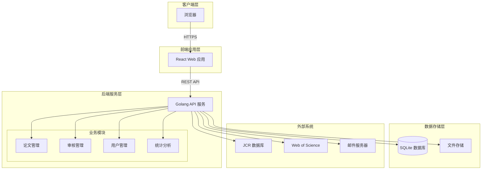

### 1.2 技术栈选型

#### 1.2.1 前端技术栈

| 技术 | 选型 | 版本 | 选型理由 |
|------|------|------|----------|
| **框架** | React | 18.x | 组件化开发，生态丰富，性能优秀，适合复杂表单和表格场景 |
| **语言** | TypeScript | 5.x | 类型安全，提升代码质量，便于维护和重构 |
| **UI 框架** | Ant Design | 5.x | 企业级 UI 组件库，组件丰富，符合内网系统审美，支持主题定制 |
| **状态管理** | Zustand | 4.x | 轻量级状态管理，API 简洁，性能优于 Redux，适合中型项目 |
| **路由** | React Router | 6.x | 成熟的 React 路由方案，支持懒加载和权限路由 |
| **HTTP 客户端** | Axios | 1.x | 功能完善，支持拦截器，便于统一处理认证和错误 |
| **表单处理** | React Hook Form | 7.x | 高性能表单库，减少重渲染，适合复杂表单校验场景 |
| **图表库** | ECharts | 5.x | 百度开源，文档完善，图表类型丰富，适合统计分析场景 |
| **构建工具** | Vite | 5.x | 基于 ES Module，开发启动快，热更新迅速，提升开发体验 |

**替代方案对比**：
- Vue 3 + Element Plus：学习曲线低，但生态略逊于 React，团队更熟悉 React
- Angular：功能全面但过于重量级，学习曲线陡峭

#### 1.2.2 后端技术栈

| 技术 | 选型 | 版本 | 选型理由 |
|------|------|------|----------|
| **语言** | Golang | 1.21+ | 高性能、编译型、并发模型优秀、部署简单、内存占用低 |
| **Web 框架** | Gin | 1.9+ | 高性能 HTTP Web 框架，API 简洁，中间件生态丰富，社区活跃 |
| **ORM** | GORM | 2.5+ | Go 语言最流行 ORM，支持关联、事务、钩子，API 友好 |
| **安全框架** | Go-Playground/Validator | 10.x | 强大的数据验证库，支持自定义规则 |
| **JWT 库** | Golang-JWT/JWT | 5.x | 社区标准 JWT 实现，维护活跃，安全可靠 |
| **密码哈希** | bcrypt | - | Go 标准库支持，安全的密码哈希算法 |
| **日志框架** | Zap | 1.x | Uber 开源，高性能结构化日志库 |
| **配置管理** | Viper | 1.x | 支持多格式、热加载、环境变量，功能完善 |
| **Excel 处理** | Excelize | 2.x | Go 语言 Excel 处理库，支持读写，性能优秀 |
| **PDF 处理** | GoFPDF | 2.x | Go 语言 PDF 生成库，简单易用 |
| **邮件发送** | Go Mail | - | Go 标准库 net/smtp，配置简单 |

**替代方案对比**：
- Echo：轻量级框架，性能略优于 Gin，但中间件生态稍弱
- Fiber：基于 Fasthttp，性能最强，但 API 风格与标准库差异大
- Beego：全功能框架，过于重量级，学习曲线陡峭

**选型理由**：
- Gin 性能优秀，中间件生态丰富，社区活跃，适合快速开发
- GORM 是 Go 语言事实标准的 ORM，文档完善，支持 SQLite 特性
- Go 语言编译为单一二进制文件，部署简单，内存占用低，适合内网环境

#### 1.2.3 数据库与中间件

| 技术 | 选型 | 版本 | 选型理由 |
|------|------|------|----------|
| **主数据库** | SQLite | 3.x | 零配置、嵌入式、单文件、ACID 事务、适合中小型应用 |
| **缓存** | 内存缓存（Go Map + RWMutex） | - | 无额外依赖，通过互斥锁保证并发安全，适合单机场景 |
| **文件存储** | 本地存储 | - | 简单可靠，后期可切换 MinIO 对象存储 |
| **消息队列** | 暂不引入 | - | 初期邮件通知等异步任务通过 goroutine 处理 |

**数据库选型理由**：
- SQLite vs PostgreSQL：SQLite 零配置、单文件、部署简单，适合内网单机部署场景
- SQLite 并发写入限制通过 WAL 模式和连接池优化，50+ 并发完全胜任
- 无 Redis 场景下，使用内存缓存（Go Map + RWMutex）存储会话和热点数据

### 1.3 系统分层设计

系统采用经典的**四层架构**：

```
┌─────────────────────────────────────────┐
│           表现层 (Presentation)          │
│  ┌─────────────────────────────────┐    │
│  │      React 前端应用              │    │
│  │  - 页面组件                      │    │
│  │  - 表单组件                      │    │
│  │  - 列表组件                      │    │
│  └─────────────────────────────────┘    │
└─────────────────────────────────────────┘
                    ↓ HTTPS
┌─────────────────────────────────────────┐
│           接口层 (Interface)             │
│  ┌─────────────────────────────────┐    │
│  │   Gin REST API                  │    │
│  │  - Handler (HTTP 处理)           │    │
│  │  - DTO (数据传输对象)            │    │
│  │  - 统一响应封装                  │    │
│  │  - 中间件 (认证/日志/恢复)        │    │
│  └─────────────────────────────────┘    │
└─────────────────────────────────────────┘
                    ↓
┌─────────────────────────────────────────┐
│          业务层 (Business)               │
│  ┌─────────────────────────────────┐    │
│  │   Services                      │    │
│  │  - 业务逻辑实现                  │    │
│  │  - 事务管理                      │    │
│  │  - 权限校验                      │    │
│  │  - 领域模型 (Domain Model)       │    │
│  └─────────────────────────────────┘    │
└─────────────────────────────────────────┘
                    ↓
┌─────────────────────────────────────────┐
│         持久层 (Persistence)             │
│  ┌─────────────────────────────────┐    │
│  │   GORM + SQLite                 │    │
│  │  - Model (实体类)                │    │
│  │  - Repository (数据访问接口)     │    │
│  │  - DAO (数据访问实现)            │    │
│  └─────────────────────────────────┘    │
└─────────────────────────────────────────┘
```

**各层职责**：

1. **表现层**：负责 UI 展示和用户交互
   - 页面渲染
   - 表单校验
   - 状态管理
   - 路由导航

2. **接口层**：负责 HTTP 请求处理和响应
   - 路由分发
   - 参数校验
   - 认证授权
   - 统一响应格式
   - 异常处理

3. **业务层**：负责核心业务逻辑
   - 业务流程控制
   - 业务规则校验
   - 事务管理
   - 领域模型操作
   - 外部服务调用

4. **持久层**：负责数据持久化
   - CRUD 操作
   - 复杂查询
   - 事务支持
   - 缓存管理

---

## 2. 技术架构设计

### 2.1 前端架构

#### 2.1.1 技术架构

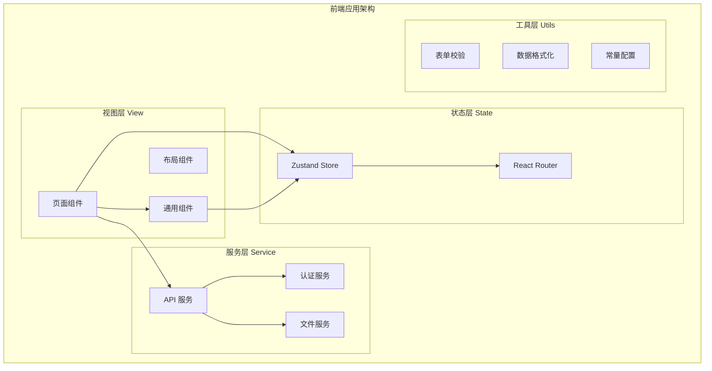

#### 2.1.2 目录结构

```
src/frontend/
├─ components/              # 通用组件
│  ├─ common/              # 通用基础组件
│  │  ├─ PageHeader.tsx    # 页面标题组件
│  │  ├─ SearchForm.tsx    # 搜索表单组件
│  │  ├─ DataTable.tsx     # 数据表格组件
│  │  └─ FileUpload.tsx    # 文件上传组件
│  ├─ paper/               # 论文相关组件
│  │  ├─ PaperForm.tsx     # 论文表单组件
│  │  ├─AuthorList.tsx     # 作者列表组件
│  │  └─ ProjectSelector.tsx # 课题选择器
│  └─ review/              # 审核相关组件
│     ├─ ReviewForm.tsx    # 审核表单组件
│     └─ ReviewStatus.tsx  # 审核状态组件
├─ pages/                   # 页面组件
│  ├─ login/               # 登录页
│  │  └─ LoginPage.tsx
│  ├─ dashboard/           # 首页
│  │  └─ DashboardPage.tsx
│  ├─ paper/               # 论文管理
│  │  ├─PaperListPage.tsx  # 论文列表
│  │  ├─PaperCreatePage.tsx # 论文录入
│  │  └─PaperDetailPage.tsx # 论文详情
│  ├─ review/              # 审核管理
│  │  ├─ReviewListPage.tsx # 审核列表
│  │  └─ReviewPage.tsx     # 审核页面
│  ├─ search/              # 查询检索
│  │  └─ SearchPage.tsx
│  ├─ archive/             # 归档管理
│  │  └─ ArchivePage.tsx
│  ├─ stats/               # 统计分析
│  │  └─ StatsPage.tsx
│  └─ system/              # 系统管理
│     ├─ UserPage.tsx      # 用户管理
│     ├─ ProjectPage.tsx   # 课题管理
│     ├─ JournalPage.tsx   # 期刊管理
│     └─ ConfigPage.tsx    # 系统配置
├─ stores/                  # 状态管理
│  ├─ userStore.ts          # 用户状态
│  ├─ paperStore.ts         # 论文状态
│  └─ appStore.ts           # 应用状态
├─ services/                # API 服务
│  ├─ api.ts                # HTTP 客户端封装
│  ├─ authService.ts        # 认证服务
│  ├─ paperService.ts       # 论文服务
│  ├─ reviewService.ts      # 审核服务
│  ├─ searchService.ts      # 检索服务
│  ├─ statsService.ts       # 统计服务
│  └─ systemService.ts      # 系统服务
├─ hooks/                   # 自定义 Hooks
│  ├─ useAuth.ts            # 认证 Hook
│  ├─ usePermission.ts      # 权限 Hook
│  └─ usePagination.ts      # 分页 Hook
├─ utils/                   # 工具函数
│  ├─ validators.ts         # 表单校验
│  ├─ formatters.ts         # 数据格式化
│  ├─ constants.ts          # 常量定义
│  └─ helpers.ts            # 辅助函数
├─ types/                   # TypeScript 类型
│  ├─ api.ts                # API 响应类型
│  ├─ paper.ts              # 论文相关类型
│  ├─ user.ts               # 用户相关类型
│  └─ common.ts             # 通用类型
└─ App.tsx                  # 应用入口
```

#### 2.1.3 核心组件设计

**1. 论文表单组件 (PaperForm)**

```typescript
interface PaperFormProps {
  mode: 'create' | 'edit' | 'view';
  initialData?: PaperDTO;
  onSubmit: (data: PaperDTO) => Promise<void>;
}

// 字段校验规则
const validationRules = {
  title: { required: true, max: 500 },
  doi: { 
    required: true, 
    pattern: /^10\.\d{4,9}\/[-._;()/:A-Z0-9]+$/i,
    message: 'DOI 格式不正确'
  },
  publishDate: { required: true, format: 'YYYY-MM-DD' },
  impactFactor: { type: 'number', min: 0 },
  abstract: { max: 5000 },
  // ... 其他字段
};
```

**2. 审核表单组件 (ReviewForm)**

```typescript
interface ReviewFormProps {
  paperId: string;
  reviewType: 'business' | 'political';
  onSubmit: (data: ReviewDTO) => Promise<void>;
}

// 驳回时必须填写原因
const validationRules = {
  result: { required: true },
  comment: { 
    required: (values) => values.result === 'reject',
    message: '请填写驳回原因'
  }
};
```

**3. 数据表格组件 (DataTable)**

```typescript
interface DataTableProps<T> {
  columns: ColumnDef<T>[];
  dataSource: T[];
  loading?: boolean;
  pagination?: {
    current: number;
    pageSize: number;
    total: number;
    onChange: (page: number, size: number) => void;
  };
  sorter?: {
    field: string;
    order: 'ascend' | 'descend';
  };
  rowSelection?: RowSelectionProps;
}
```

#### 2.1.4 状态管理设计

**用户状态 (userStore)**

```typescript
interface UserState {
  user: UserInfo | null;
  token: string | null;
  permissions: string[];
  isAuthenticated: boolean;
  
  // Actions
  login: (credentials: LoginRequest) => Promise<void>;
  logout: () => void;
  updatePermissions: (permissions: string[]) => void;
}

// Zustand Store 实现
const useUserStore = create<UserState>((set) => ({
  user: null,
  token: localStorage.getItem('token'),
  permissions: [],
  isAuthenticated: !!localStorage.getItem('token'),
  
  login: async (credentials) => {
    const response = await authService.login(credentials);
    set({ 
      token: response.data.token,
      user: response.data.user,
      isAuthenticated: true 
    });
    localStorage.setItem('token', response.data.token);
  },
  
  logout: () => {
    set({ user: null, token: null, isAuthenticated: false });
    localStorage.removeItem('token');
  },
  
  updatePermissions: (permissions) => {
    set({ permissions });
  }
}));
```

### 2.2 后端架构

#### 2.2.1 技术架构

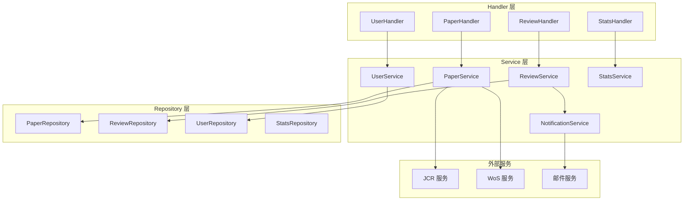

#### 2.2.2 目录结构

```
src/backend/
├─ cmd/
│  └─ server/
│     └─ main.go            # 应用入口
├─ internal/
│  ├─ handler/              # Handler 层（HTTP 处理）
│  │  ├─ auth_handler.go    # 认证处理器
│  │  ├─ paper_handler.go   # 论文处理器
│  │  ├─ review_handler.go  # 审核处理器
│  │  ├─ user_handler.go    # 用户处理器
│  │  ├─ search_handler.go  # 检索处理器
│  │  ├─ stats_handler.go   # 统计处理器
│  │  └─ system_handler.go  # 系统处理器
│  ├─ service/              # Service 层（业务逻辑）
│  │  ├─ auth_service.go    # 认证服务
│  │  ├─ paper_service.go   # 论文服务
│  │  ├─ review_service.go  # 审核服务
│  │  ├─ user_service.go    # 用户服务
│  │  ├─ search_service.go  # 检索服务
│  │  ├─ stats_service.go   # 统计服务
│  │  ├─ notification_service.go  # 通知服务
│  │  └─ archive_service.go # 归档服务
│  ├─ repository/           # Repository 层（数据访问）
│  │  ├─ user_repository.go
│  │  ├─ paper_repository.go
│  │  ├─ review_repository.go
│  │  ├─ project_repository.go
│  │  ├─ journal_repository.go
│  │  └─ archive_repository.go
│  ├─ model/                # 数据模型
│  │  ├─ entity/            # 实体类
│  │  │  ├─ user.go
│  │  │  ├─ paper.go
│  │  │  ├─ author.go
│  │  │  ├─ project.go
│  │  │  ├─ review_log.go
│  │  │  └─ ...
│  │  ├─ dto/              # DTO
│  │  │  ├─ request/       # 请求 DTO
│  │  │  └─ response/      # 响应 DTO
│  │  └─ vo/               # VO
│  ├─ middleware/           # 中间件
│  │  ├─ auth_middleware.go # 认证中间件
│  │  ├─ cors_middleware.go # CORS 中间件
│  │  ├─ logger_middleware.go # 日志中间件
│  │  └─ recovery_middleware.go # 异常恢复中间件
│  ├─ config/               # 配置
│  │  ├─ config.go         # 配置加载
│  │  └─ database.go       # 数据库配置
│  ├─ database/             # 数据库
│  │  ├─ sqlite.go         # SQLite 连接
│  │  └─ migration.go      # 数据库迁移
│  ├─ cache/                # 缓存（内存缓存）
│  │  ├─ cache.go          # 缓存接口
│  │  └─ memory_cache.go   # 内存缓存实现
│  ├─ security/             # 安全相关
│  │  ├─ jwt.go            # JWT 工具
│  │  ├─ password.go       # 密码哈希
│  │  └─ permission.go     # 权限评估
│  ├─ validator/            # 数据验证
│  │  └─ validator.go      # 验证器配置
│  └─ utils/                # 工具类
│     ├─ date.go
│     ├─ file.go
│     ├─ excel.go
│     └─ ...
├─ pkg/                    # 可复用包
│  ├─ logger/
│  │  └─ logger.go
│  └─ response/
│     └─ response.go
├─ uploads/                # 文件上传目录
│  ├─ papers/
│  └─ exports/
├─ go.mod
├─ go.sum
└─ Makefile
```

#### 2.2.3 核心代码设计

**1. 统一响应格式**

```go
package response

type ApiResponse struct {
    Code string      `json:"code"`
    Msg  string      `json:"msg"`
    Data interface{} `json:"data,omitempty"`
}

// Success 成功响应
func Success(data interface{}) ApiResponse {
    return ApiResponse{
        Code: "000000",
        Msg:  "success",
        Data: data,
    }
}

// Error 错误响应
func Error(code string, msg string) ApiResponse {
    return ApiResponse{
        Code: code,
        Msg:  msg,
        Data: nil,
    }
}

// PageResult 分页结果
type PageResult struct {
    List  interface{} `json:"list"`
    Total int64       `json:"total"`
    Page  int         `json:"page"`
    Size  int         `json:"size"`
}
```

**2. 错误码定义**

```go
package errors

// ErrorCode 错误码
type ErrorCode struct {
    Code string
    Msg  string
}

// 通用错误 (100xxx)
var (
    ErrSuccess       = &ErrorCode{"000000", "操作成功"}
    ErrSystemError   = &ErrorCode{"100001", "系统异常"}
    ErrParamError    = &ErrorCode{"100002", "参数错误"}
    ErrUnauthorized  = &ErrorCode{"100003", "未授权"}
    ErrForbidden     = &ErrorCode{"100004", "无权限"}
    ErrNotFound      = &ErrorCode{"100005", "资源不存在"}
)

// 认证错误 (101xxx)
var (
    ErrLoginFailed    = &ErrorCode{"101001", "用户名或密码错误"}
    ErrAccountLocked  = &ErrorCode{"101002", "账户已锁定"}
    ErrAccountDisabled = &ErrorCode{"101003", "账户已禁用"}
    ErrSessionExpired = &ErrorCode{"101004", "会话已过期"}
)

// 论文错误 (102xxx)
var (
    ErrPaperDuplicate     = &ErrorCode{"102001", "论文重复"}
    ErrPaperNotFound      = &ErrorCode{"102002", "论文不存在"}
    ErrPaperNotAllowedEdit = &ErrorCode{"102003", "论文不允许修改"}
)

// 审核错误 (103xxx)
var (
    ErrReviewNotFound   = &ErrorCode{"103001", "审核记录不存在"}
    ErrReviewNotAllowed = &ErrorCode{"103002", "无审核权限"}
    ErrReviewAlreadyDone = &ErrorCode{"103003", "已审核"}
)

// 文件错误 (104xxx)
var (
    ErrFileTooLarge    = &ErrorCode{"104001", "文件超过大小限制"}
    ErrFileFormatError = &ErrorCode{"104002", "文件格式错误"}
    ErrFileUploadFailed = &ErrorCode{"104003", "文件上传失败"}
)
```

**3. 内存缓存实现**

```go
package cache

import (
    "sync"
    "time"
)

// Item 缓存项
type Item struct {
    Value      interface{}
    Expiration int64
}

// MemoryCache 内存缓存
type MemoryCache struct {
    items map[string]Item
    mu    sync.RWMutex
}

// NewMemoryCache 创建内存缓存
func NewMemoryCache() *MemoryCache {
    cache := &MemoryCache{
        items: make(map[string]Item),
    }
    // 启动清理过期缓存的 goroutine
    go cache.startCleanup()
    return cache
}

// Set 设置缓存
func (c *MemoryCache) Set(key string, value interface{}, expiration time.Duration) {
    c.mu.Lock()
    defer c.mu.Unlock()
    
    var expirationTime int64
    if expiration > 0 {
        expirationTime = time.Now().Add(expiration).UnixNano()
    }
    
    c.items[key] = Item{
        Value:      value,
        Expiration: expirationTime,
    }
}

// Get 获取缓存
func (c *MemoryCache) Get(key string) (interface{}, bool) {
    c.mu.RLock()
    defer c.mu.RUnlock()
    
    item, found := c.items[key]
    if !found {
        return nil, false
    }
    
    // 检查是否过期
    if item.Expiration > 0 && time.Now().UnixNano() > item.Expiration {
        return nil, false
    }
    
    return item.Value, true
}

// Delete 删除缓存
func (c *MemoryCache) Delete(key string) {
    c.mu.Lock()
    defer c.mu.Unlock()
    delete(c.items, key)
}

// 清理过期缓存
func (c *MemoryCache) startCleanup() {
    ticker := time.NewTicker(1 * time.Minute)
    for range ticker.C {
        c.mu.Lock()
        now := time.Now().UnixNano()
        for key, item := range c.items {
            if item.Expiration > 0 && now > item.Expiration {
                delete(c.items, key)
            }
        }
        c.mu.Unlock()
    }
}
```

### 2.3 数据库设计

#### 2.3.1 ER 图

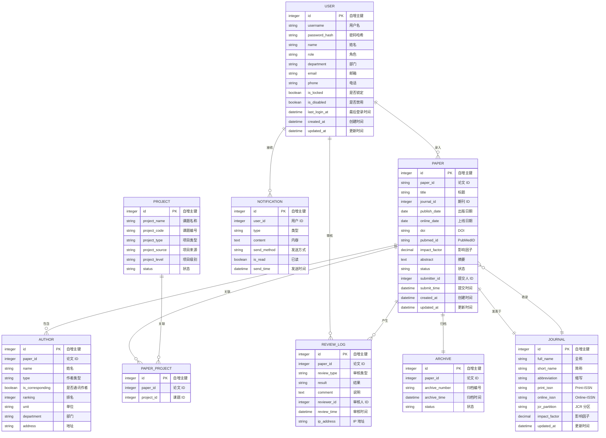

#### 2.3.2 核心表结构（SQLite 语法）

**1. 用户表 (users)**

```sql
CREATE TABLE users (
    id INTEGER PRIMARY KEY AUTOINCREMENT,
    username TEXT NOT NULL UNIQUE,
    password_hash TEXT NOT NULL,
    name TEXT NOT NULL,
    role TEXT NOT NULL,  -- super_admin, admin, dept_head, project_leader, business_reviewer, political_reviewer, user
    department TEXT,
    id_card TEXT,         -- 加密存储
    phone TEXT,           -- 加密存储
    email TEXT,
    is_locked INTEGER DEFAULT 0,
    lock_until DATETIME,
    is_disabled INTEGER DEFAULT 0,
    login_fail_count INTEGER DEFAULT 0,
    last_login_at DATETIME,
    last_login_ip TEXT,
    created_at DATETIME DEFAULT CURRENT_TIMESTAMP,
    updated_at DATETIME DEFAULT CURRENT_TIMESTAMP
);

CREATE INDEX idx_users_username ON users(username);
CREATE INDEX idx_users_role ON users(role);
CREATE INDEX idx_users_department ON users(department);
```

**2. 论文表 (papers)**

```sql
CREATE TABLE papers (
    id INTEGER PRIMARY KEY AUTOINCREMENT,
    paper_id TEXT NOT NULL UNIQUE,
    title TEXT NOT NULL,
    journal_id INTEGER REFERENCES journals(id),
    publish_date DATE,
    online_date DATE,
    volume TEXT,
    issue TEXT,
    start_page TEXT,
    end_page TEXT,
    doi TEXT,
    pubmed_id TEXT,
    impact_factor DECIMAL(10,3),
    temp_impact_factor DECIMAL(10,3),
    abstract TEXT,
    is_sci INTEGER DEFAULT 0,
    is_ei INTEGER DEFAULT 0,
    is_ci INTEGER DEFAULT 0,
    is_di INTEGER DEFAULT 0,
    is_core INTEGER DEFAULT 0,
    language TEXT,
    partition TEXT,
    citation_count INTEGER DEFAULT 0,
    other_citation_count INTEGER DEFAULT 0,
    status TEXT DEFAULT 'draft',
    submitter_id INTEGER REFERENCES users(id),
    submit_time DATETIME,
    full_text_path TEXT,
    first_page_path TEXT,
    journal_cover_path TEXT,
    approval_doc_path TEXT,
    created_by INTEGER REFERENCES users(id),
    created_at DATETIME DEFAULT CURRENT_TIMESTAMP,
    updated_at DATETIME DEFAULT CURRENT_TIMESTAMP
);

CREATE INDEX idx_papers_paper_id ON papers(paper_id);
CREATE INDEX idx_papers_title ON papers(title);
CREATE INDEX idx_papers_doi ON papers(doi);
CREATE INDEX idx_papers_status ON papers(status);
CREATE INDEX idx_papers_publish_date ON papers(publish_date);
CREATE INDEX idx_papers_impact_factor ON papers(impact_factor);
CREATE INDEX idx_papers_submitter ON papers(submitter_id);
```

**3. 作者表 (authors)**

```sql
CREATE TABLE authors (
    id INTEGER PRIMARY KEY AUTOINCREMENT,
    paper_id INTEGER NOT NULL REFERENCES papers(id) ON DELETE CASCADE,
    name TEXT NOT NULL,
    type TEXT NOT NULL,
    is_corresponding INTEGER DEFAULT 0,
    is_co_corresponding INTEGER DEFAULT 0,
    ranking INTEGER NOT NULL,
    unit TEXT,
    department TEXT,
    address TEXT,
    remark TEXT
);

CREATE INDEX idx_authors_paper ON authors(paper_id);
CREATE INDEX idx_authors_name ON authors(name);
```

**4. 课题表 (projects)**

```sql
CREATE TABLE projects (
    id INTEGER PRIMARY KEY AUTOINCREMENT,
    project_name TEXT NOT NULL,
    project_code TEXT,
    project_type TEXT,
    project_source TEXT,
    project_level TEXT,
    status TEXT DEFAULT 'pending',
    created_by INTEGER REFERENCES users(id),
    created_at DATETIME DEFAULT CURRENT_TIMESTAMP,
    updated_at DATETIME DEFAULT CURRENT_TIMESTAMP
);

CREATE INDEX idx_projects_code ON projects(project_code);
CREATE INDEX idx_projects_status ON projects(status);
```

**5. 论文课题关联表 (paper_projects)**

```sql
CREATE TABLE paper_projects (
    id INTEGER PRIMARY KEY AUTOINCREMENT,
    paper_id INTEGER NOT NULL REFERENCES papers(id) ON DELETE CASCADE,
    project_id INTEGER NOT NULL REFERENCES projects(id) ON DELETE CASCADE,
    UNIQUE(paper_id, project_id)
);

CREATE INDEX idx_paper_projects_paper ON paper_projects(paper_id);
CREATE INDEX idx_paper_projects_project ON paper_projects(project_id);
```

**6. 期刊表 (journals)**

```sql
CREATE TABLE journals (
    id INTEGER PRIMARY KEY AUTOINCREMENT,
    full_name TEXT NOT NULL UNIQUE,
    short_name TEXT,
    abbreviation TEXT,
    print_issn TEXT,
    online_issn TEXT,
    jcr_partition TEXT,
    impact_factor DECIMAL(10,3),
    updated_at DATETIME DEFAULT CURRENT_TIMESTAMP
);

CREATE INDEX idx_journals_name ON journals(full_name);
CREATE INDEX idx_journals_issn ON journals(print_issn, online_issn);
```

**7. 审核记录表 (review_logs)**

```sql
CREATE TABLE review_logs (
    id INTEGER PRIMARY KEY AUTOINCREMENT,
    paper_id INTEGER NOT NULL REFERENCES papers(id),
    review_type TEXT NOT NULL,
    result TEXT NOT NULL,
    comment TEXT,
    reviewer_id INTEGER NOT NULL REFERENCES users(id),
    review_time DATETIME DEFAULT CURRENT_TIMESTAMP,
    ip_address TEXT,
    is_overdue INTEGER DEFAULT 0
);

CREATE INDEX idx_review_logs_paper ON review_logs(paper_id);
CREATE INDEX idx_review_logs_reviewer ON review_logs(reviewer_id);
CREATE INDEX idx_review_logs_type ON review_logs(review_type);
```

**8. 归档记录表 (archives)**

```sql
CREATE TABLE archives (
    id INTEGER PRIMARY KEY AUTOINCREMENT,
    paper_id INTEGER NOT NULL UNIQUE REFERENCES papers(id),
    archive_number TEXT NOT NULL UNIQUE,
    archive_time DATETIME DEFAULT CURRENT_TIMESTAMP,
    status TEXT DEFAULT 'public'
);

CREATE INDEX idx_archives_paper ON archives(paper_id);
CREATE INDEX idx_archives_number ON archives(archive_number);
CREATE INDEX idx_archives_status ON archives(status);
```

**9. 通知表 (notifications)**

```sql
CREATE TABLE notifications (
    id INTEGER PRIMARY KEY AUTOINCREMENT,
    user_id INTEGER NOT NULL REFERENCES users(id),
    type TEXT NOT NULL,
    title TEXT,
    content TEXT NOT NULL,
    send_method TEXT,
    is_read INTEGER DEFAULT 0,
    read_time DATETIME,
    send_time DATETIME DEFAULT CURRENT_TIMESTAMP
);

CREATE INDEX idx_notifications_user ON notifications(user_id);
CREATE INDEX idx_notifications_type ON notifications(type);
CREATE INDEX idx_notifications_read ON notifications(is_read);
```

**10. 操作日志表 (operation_logs)**

```sql
CREATE TABLE operation_logs (
    id INTEGER PRIMARY KEY AUTOINCREMENT,
    user_id INTEGER REFERENCES users(id),
    operation_type TEXT NOT NULL,
    module TEXT,
    target_id INTEGER,
    operation_content TEXT,
    operation_result TEXT,
    ip_address TEXT,
    created_at DATETIME DEFAULT CURRENT_TIMESTAMP
);

CREATE INDEX idx_operation_logs_user ON operation_logs(user_id);
CREATE INDEX idx_operation_logs_type ON operation_logs(operation_type);
CREATE INDEX idx_operation_logs_time ON operation_logs(created_at);
```

#### 2.3.3 SQLite 并发优化方案

**1. 启用 WAL 模式**

```go
package database

import (
    "gorm.io/driver/sqlite"
    "gorm.io/gorm"
    "gorm.io/gorm/logger"
)

// InitDB 初始化数据库连接
func InitDB(dbPath string) (*gorm.DB, error) {
    // 启用 WAL 模式，提升并发性能
    dsn := dbPath + "?_journal_mode=WAL&_busy_timeout=5000&_cache_size=10000"
    
    db, err := gorm.Open(sqlite.Open(dsn), &gorm.Config{
        Logger: logger.Default.LogMode(logger.Info),
    })
    if err != nil {
        return nil, err
    }
    
    // 获取底层 sql.DB 进行配置
    sqlDB, err := db.DB()
    if err != nil {
        return nil, err
    }
    
    // 配置连接池
    sqlDB.SetMaxIdleConns(10)        // 最大空闲连接数
    sqlDB.SetMaxOpenConns(100)       // 最大打开连接数
    sqlDB.SetConnMaxLifetime(time.Hour) // 连接最大生命周期
    
    return db, nil
}
```

**2. 事务优化**

```go
// 使用事务处理批量操作
func (r *paperRepository) BatchCreate(papers []model.Paper) error {
    return r.db.Transaction(func(tx *gorm.DB) error {
        // 批量插入，每批 100 条
        batchSize := 100
        for i := 0; i < len(papers); i += batchSize {
            end := i + batchSize
            if end > len(papers) {
                end = len(papers)
            }
            batch := papers[i:end]
            if err := tx.Create(&batch).Error; err != nil {
                return err
            }
        }
        return nil
    })
}
```

**3. 读写分离优化**

```go
// 使用不同的连接处理读写操作
type Database struct {
    writeDB *gorm.DB
    readDB  *gorm.DB
}

// 写操作使用主库
func (db *Database) Write() *gorm.DB {
    return db.writeDB
}

// 读操作使用从库（可以配置多个）
func (db *Database) Read() *gorm.DB {
    return db.readDB
}
```

### 2.4 缓存设计

#### 2.4.1 缓存策略

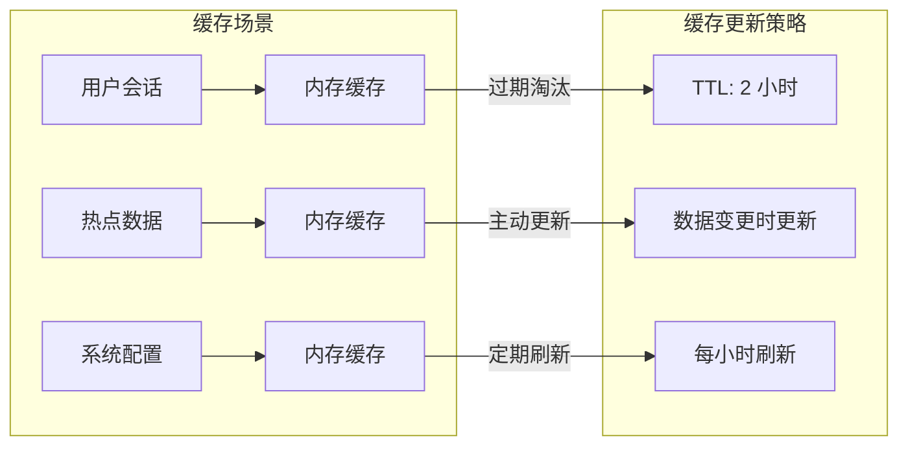

#### 2.4.2 缓存 Key 设计

```go
package cache

// CacheKeys 缓存键
type CacheKeys struct{}

func (CacheKeys) SessionKey(token string) string {
    return "session:" + token
}

func (CacheKeys) UserKey(userId int64) string {
    return "user:" + userId
}

func (CacheKeys) JournalImpactKey(issn string) string {
    return "journal:impact:" + issn
}

func (CacheKeys) ConfigKey(key string) string {
    return "config:" + key
}

func (CacheKeys) ReviewReminderKey(paperId int64) string {
    return "review:reminder:" + paperId
}
```

#### 2.4.3 缓存配置

```go
package config

type CacheConfig struct {
    // 会话缓存 TTL（2 小时）
    SessionTTL time.Duration `mapstructure:"session_ttl" default:"2h"`
    // 用户信息缓存 TTL（30 分钟）
    UserInfoTTL time.Duration `mapstructure:"user_info_ttl" default:"30m"`
    // 期刊影响因子缓存 TTL（24 小时）
    JournalImpactTTL time.Duration `mapstructure:"journal_impact_ttl" default:"24h"`
    // 系统配置缓存 TTL（1 小时）
    SystemConfigTTL time.Duration `mapstructure:"system_config_ttl" default:"1h"`
}
```

### 2.5 文件存储设计

#### 2.5.1 存储方案

**本地存储**
```
uploads/
├─ papers/              # 论文附件
│  ├─ full_text/        # 论文全文 PDF
│  ├─ first_page/       # 论文首页
│  ├─ journal_cover/    # 期刊封面
│  └─ approval_doc/     # 审批件
└─ exports/             # 导出文件
   ├─ excel/
   └─ pdf/
```

#### 2.5.2 文件命名规则

```go
package utils

import (
    "fmt"
    "path/filepath"
    "time"

    "github.com/google/uuid"
)

// GenerateFilePath 生成文件存储路径
func GenerateFilePath(module string, originalFilename string) string {
    extension := filepath.Ext(originalFilename)
    uuidStr := uuid.New().String()
    yearMonth := time.Now().Format("2006/01")
    return fmt.Sprintf("%s/%s/%s%s", module, yearMonth, uuidStr, extension)
}
```

#### 2.5.3 文件上传限制

```go
package middleware

const (
    // 最大上传文件大小：100MB
    MaxUploadSize = 100 * 1024 * 1024
)

// FileSizeLimitMiddleware 文件大小限制中间件
func FileSizeLimitMiddleware() gin.HandlerFunc {
    return func(c *gin.Context) {
        c.Request.Body = http.MaxBytesReader(c.Writer, c.Request.Body, MaxUploadSize)
        c.Next()
    }
}
```

---

## 3. 核心模块设计

### 3.1 用户认证与权限模块

#### 3.1.1 认证流程

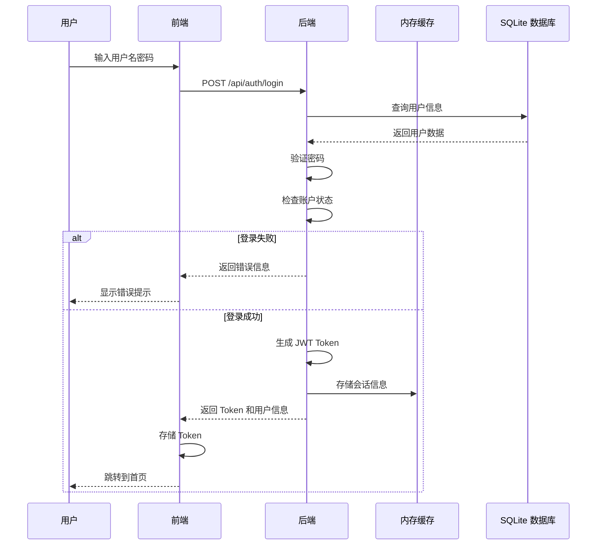

#### 3.1.2 JWT Token 结构

```go
package security

import (
    "time"
    
    "github.com/golang-jwt/jwt/v5"
)

// Claims JWT 声明
type Claims struct {
    UserID      int64    `json:"user_id"`
    Username    string   `json:"username"`
    Role        string   `json:"role"`
    Permissions []string `json:"permissions"`
    jwt.RegisteredClaims
}

// Token 有效期：2 小时
const TokenExpireTime = 2 * time.Hour

// GenerateToken 生成 JWT Token
func GenerateToken(user *model.User, permissions []string) (string, error) {
    claims := Claims{
        UserID:      user.ID,
        Username:    user.Username,
        Role:        user.Role,
        Permissions: permissions,
        RegisteredClaims: jwt.RegisteredClaims{
            ExpiresAt: jwt.NewNumericDate(time.Now().Add(TokenExpireTime)),
            IssuedAt:  jwt.NewNumericDate(time.Now()),
            Issuer:    "biolitmanager",
        },
    }
    
    token := jwt.NewWithClaims(jwt.SigningMethodHS512, claims)
    return token.SignedString([]byte(jwtSecret))
}

// ParseToken 解析 JWT Token
func ParseToken(tokenString string) (*Claims, error) {
    token, err := jwt.ParseWithClaims(tokenString, &Claims{}, func(token *jwt.Token) (interface{}, error) {
        return []byte(jwtSecret), nil
    })
    
    if err != nil {
        return nil, err
    }
    
    if claims, ok := token.Claims.(*Claims); ok && token.Valid {
        return claims, nil
    }
    
    return nil, fmt.Errorf("invalid token")
}
```

#### 3.1.3 RBAC 权限模型

```go
package security

// Role 角色定义
type Role string

const (
    RoleSuperAdmin       Role = "super_admin"
    RoleAdmin            Role = "admin"
    RoleDeptHead         Role = "dept_head"
    RoleProjectLeader    Role = "project_leader"
    RoleBusinessReviewer Role = "business_reviewer"
    RolePoliticalReviewer Role = "political_reviewer"
    RoleUser             Role = "user"
)

// Permission 权限定义
type Permission string

const (
    // 论文管理
    PermPaperCreate  Permission = "paper:create"
    PermPaperEdit    Permission = "paper:edit"
    PermPaperView    Permission = "paper:view"
    PermPaperDelete  Permission = "paper:delete"
    PermPaperExport  Permission = "paper:export"
    
    // 审核管理
    PermReviewBusiness  Permission = "review:business"
    PermReviewPolitical Permission = "review:political"
    
    // 系统管理
    PermUserManage    Permission = "system:user:manage"
    PermProjectManage Permission = "system:project:manage"
    PermJournalManage Permission = "system:journal:manage"
    PermConfigManage  Permission = "system:config:manage"
    
    // 统计分析
    PermStatsView   Permission = "stats:view"
    PermStatsExport Permission = "stats:export"
)

// RolePermissions 角色权限映射
var RolePermissions = map[Role][]Permission{
    RoleSuperAdmin: {
        PermPaperCreate, PermPaperEdit, PermPaperView, PermPaperDelete, PermPaperExport,
        PermReviewBusiness, PermReviewPolitical,
        PermUserManage, PermProjectManage, PermJournalManage, PermConfigManage,
        PermStatsView, PermStatsExport,
    },
    RoleAdmin: {
        PermPaperCreate, PermPaperEdit, PermPaperView, PermPaperDelete, PermPaperExport,
        PermReviewBusiness, PermReviewPolitical,
        PermUserManage, PermProjectManage, PermJournalManage,
        PermStatsView, PermStatsExport,
    },
    RoleDeptHead: {
        PermPaperCreate, PermPaperEdit, PermPaperView, PermPaperExport,
        PermReviewBusiness, PermReviewPolitical,
        PermProjectManage,
        PermStatsView, PermStatsExport,
    },
    RoleProjectLeader: {
        PermPaperCreate, PermPaperEdit, PermPaperView, PermPaperExport,
        PermReviewBusiness, PermReviewPolitical,
        PermProjectManage,
        PermStatsView, PermStatsExport,
    },
    RoleBusinessReviewer: {
        PermPaperCreate, PermPaperView, PermPaperExport,
        PermReviewBusiness,
        PermStatsView,
    },
    RolePoliticalReviewer: {
        PermPaperCreate, PermPaperView, PermPaperExport,
        PermReviewPolitical,
        PermStatsView,
    },
    RoleUser: {
        PermPaperCreate, PermPaperView, PermPaperExport,
        PermStatsView,
    },
}
```

#### 3.1.4 角色权限矩阵

| 权限 | 超级管理员 | 管理员 | 部门主管 | 课题组长 | 业务审核员 | 政工审核员 | 普通用户 |
|------|:----------:|:------:|:--------:|:--------:|:----------:|:----------:|:--------:|
| paper:create | ✓ | ✓ | ✓ | ✓ | ✓ | ✓ | ✓ |
| paper:edit | ✓ | ✓ | ✓ | ✓ | ✓ | ✓ | ✓(仅自己) |
| paper:view | ✓ | ✓ | ✓ | ✓ | ✓ | ✓ | ✓(仅自己) |
| paper:export | ✓ | ✓ | ✓ | ✓ | ✓ | ✓ | ✓(仅自己) |
| review:business | ✓ | ✓ | ✓ | ✓ | ✓ | ✗ | ✗ |
| review:political | ✓ | ✓ | ✓ | ✓ | ✗ | ✓ | ✗ |
| system:user:manage | ✓ | ✓ | ✗ | ✗ | ✗ | ✗ | ✗ |
| system:project:manage | ✓ | ✓ | ✓ | ✓ | ✗ | ✗ | ✗ |
| system:journal:manage | ✓ | ✓ | ✗ | ✗ | ✗ | ✗ | ✗ |
| system:config:manage | ✓ | ✓ | ✗ | ✗ | ✗ | ✗ | ✗ |
| stats:view | ✓ | ✓ | ✓ | ✓ | ✓ | ✓ | ✓ |
| stats:export | ✓ | ✓ | ✓ | ✓ | ✓ | ✓ | ✗ |

#### 3.1.5 核心代码实现

**认证服务**

```go
package service

import (
    "context"
    "errors"
    "time"
    
    "biolitmanager/internal/model"
    "biolitmanager/internal/repository"
    "biolitmanager/internal/security"
    "biolitmanager/internal/cache"
    "biolitmanager/pkg/response"
    "golang.org/x/crypto/bcrypt"
)

type AuthService struct {
    userRepo *repository.UserRepository
    cache    *cache.MemoryCache
}

type LoginRequest struct {
    Username string `json:"username" binding:"required"`
    Password string `json:"password" binding:"required"`
}

type LoginResponse struct {
    Token string          `json:"token"`
    User  *model.UserDTO  `json:"user"`
}

func NewAuthService(userRepo *repository.UserRepository, cache *cache.MemoryCache) *AuthService {
    return &AuthService{
        userRepo: userRepo,
        cache:    cache,
    }
}

func (s *AuthService) Login(ctx context.Context, req *LoginRequest) (*LoginResponse, error) {
    // 1. 查询用户
    user, err := s.userRepo.FindByUsername(ctx, req.Username)
    if err != nil {
        return nil, errors.New("用户名或密码错误")
    }
    
    // 2. 检查账户状态
    if user.IsDisabled {
        return nil, errors.New("账户已禁用")
    }
    if user.IsLocked && user.LockUntil.After(time.Now()) {
        return nil, errors.New("账户已锁定")
    }
    
    // 3. 验证密码
    if err := bcrypt.CompareHashAndPassword([]byte(user.PasswordHash), []byte(req.Password)); err != nil {
        // 记录失败次数
        s.incrementLoginFailCount(user)
        return nil, errors.New("用户名或密码错误")
    }
    
    // 4. 登录成功，重置失败计数
    s.resetLoginFailCount(user)
    
    // 5. 获取用户权限
    permissions := security.GetPermissionsByRole(user.Role)
    
    // 6. 生成 Token
    token, err := security.GenerateToken(user, permissions)
    if err != nil {
        return nil, errors.New("生成 Token 失败")
    }
    
    // 7. 存储会话到内存缓存
    sessionKey := cache.CacheKeys{}.SessionKey(token)
    userInfo := &model.UserInfo{
        UserID:      user.ID,
        Username:    user.Username,
        Role:        user.Role,
        Permissions: permissions,
    }
    s.cache.Set(sessionKey, userInfo, 2*time.Hour)
    
    // 8. 更新登录信息
    user.LastLoginAt = time.Now()
    user.LastLoginIP = getClientIP(ctx)
    s.userRepo.Update(user)
    
    // 9. 记录登录日志
    s.logOperation(user.ID, "login", "用户登录", "success")
    
    return &LoginResponse{
        Token: token,
        User:  model.ToUserDTO(user),
    }, nil
}

func (s *AuthService) incrementLoginFailCount(user *model.User) {
    user.LoginFailCount++
    if user.LoginFailCount >= 5 {
        user.IsLocked = true
        user.LockUntil = time.Now().Add(1 * time.Hour)
    }
    s.userRepo.Update(user)
}

func (s *AuthService) resetLoginFailCount(user *model.User) {
    user.LoginFailCount = 0
    user.IsLocked = false
    user.LockUntil = nil
    s.userRepo.Update(user)
}
```

**认证中间件**

```go
package middleware

import (
    "net/http"
    "strings"
    
    "github.com/gin-gonic/gin"
    "biolitmanager/internal/security"
    "biolitmanager/internal/cache"
)

// AuthMiddleware 认证中间件
func AuthMiddleware(cache *cache.MemoryCache) gin.HandlerFunc {
    return func(c *gin.Context) {
        token := extractToken(c)
        
        if token == "" {
            c.JSON(http.StatusUnauthorized, response.Error("100003", "未授权"))
            c.Abort()
            return
        }
        
        // 验证 Token
        claims, err := security.ParseToken(token)
        if err != nil {
            c.JSON(http.StatusUnauthorized, response.Error("100003", "Token 无效"))
            c.Abort()
            return
        }
        
        // 检查缓存中的会话
        sessionKey := cache.CacheKeys{}.SessionKey(token)
        if userInfo, found := cache.Get(sessionKey); found {
            // 设置用户信息到上下文
            c.Set("user", userInfo)
            c.Set("claims", claims)
            c.Next()
        } else {
            c.JSON(http.StatusUnauthorized, response.Error("100003", "会话已过期"))
            c.Abort()
            return
        }
    }
}

func extractToken(c *gin.Context) string {
    bearerToken := c.GetHeader("Authorization")
    if strings.HasPrefix(bearerToken, "Bearer ") {
        return strings.TrimPrefix(bearerToken, "Bearer ")
    }
    return ""
}
```

**权限中间件**

```go
package middleware

import (
    "net/http"
    
    "github.com/gin-gonic/gin"
    "biolitmanager/internal/security"
    "biolitmanager/pkg/response"
)

// PermissionMiddleware 权限中间件
func PermissionMiddleware(requiredPermission security.Permission) gin.HandlerFunc {
    return func(c *gin.Context) {
        userInfo, exists := c.Get("user")
        if !exists {
            c.JSON(http.StatusForbidden, response.Error("100004", "无权限"))
            c.Abort()
            return
        }
        
        user := userInfo.(*model.UserInfo)
        
        // 超级管理员拥有所有权限
        if user.Role == string(security.RoleSuperAdmin) {
            c.Next()
            return
        }
        
        // 检查权限
        hasPermission := false
        for _, perm := range user.Permissions {
            if perm == string(requiredPermission) {
                hasPermission = true
                break
            }
            // 支持通配符匹配
            if strings.HasSuffix(perm, ":*") {
                prefix := strings.TrimSuffix(perm, ":*")
                if strings.HasPrefix(string(requiredPermission), prefix) {
                    hasPermission = true
                    break
                }
            }
        }
        
        if !hasPermission {
            c.JSON(http.StatusForbidden, response.Error("100004", "无权限"))
            c.Abort()
            return
        }
        
        c.Next()
    }
}
```

### 3.2 论文管理模块

#### 3.2.1 业务流程

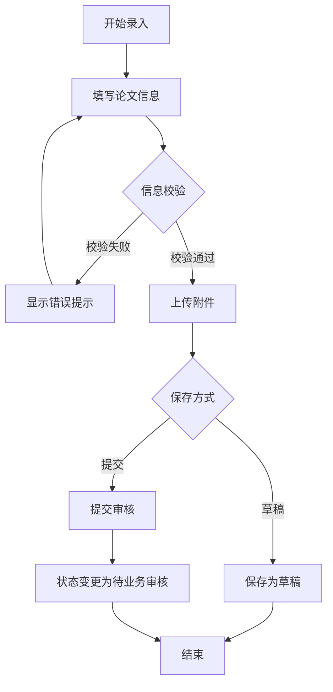

#### 3.2.2 状态机设计

```go
package model

// PaperStatus 论文状态
type PaperStatus string

const (
    PaperStatusDraft            PaperStatus = "draft"             // 草稿
    PaperStatusPendingBusiness  PaperStatus = "pending_business"  // 待业务审核
    PaperStatusPendingPolitical PaperStatus = "pending_political" // 待政工审核
    PaperStatusBusinessRejected PaperStatus = "business_rejected" // 业务审核驳回
    PaperStatusPoliticalRejected PaperStatus = "political_rejected" // 政工审核驳回
    PaperStatusApproved         PaperStatus = "approved"          // 审核通过
    PaperStatusArchived         PaperStatus = "archived"          // 已归档
)
```

#### 3.2.3 核心服务

```go
package service

import (
    "context"
    "errors"
    "fmt"
    "time"
    
    "biolitmanager/internal/model"
    "biolitmanager/internal/repository"
)

type PaperService struct {
    paperRepo   *repository.PaperRepository
    authorRepo  *repository.AuthorRepository
    projectRepo *repository.ProjectRepository
    fileStorage *FileStorageService
}

type PaperCreateRequest struct {
    Title       string                `json:"title" binding:"required"`
    JournalID   int64                 `json:"journal_id"`
    PublishDate string                `json:"publish_date" binding:"required"`
    DOI         string                `json:"doi" binding:"required"`
    ImpactFactor float64              `json:"impact_factor"`
    Abstract    string                `json:"abstract"`
    Authors     []AuthorCreateRequest `json:"authors"`
    ProjectIDs  []int64               `json:"project_ids"`
}

func (s *PaperService) CreatePaper(ctx context.Context, req *PaperCreateRequest, currentUser *model.User) (*model.PaperDTO, error) {
    // 1. 校验 DOI 格式
    if !validateDOI(req.DOI) {
        return nil, errors.New("DOI 格式不正确")
    }
    
    // 2. 校验重复
    if err := s.checkDuplicate(req.Title, req.DOI); err != nil {
        return nil, err
    }
    
    // 3. 创建事务
    tx := s.paperRepo.Begin()
    defer func() {
        if r := recover(); r != nil {
            tx.Rollback()
        }
    }()
    
    // 4. 保存论文
    paper := &model.Paper{
        Title:        req.Title,
        JournalID:    req.JournalID,
        PublishDate:  req.PublishDate,
        DOI:          req.DOI,
        ImpactFactor: req.ImpactFactor,
        Abstract:     req.Abstract,
        PaperID:      s.generatePaperID(),
        SubmitterID:  currentUser.ID,
        Status:       model.PaperStatusDraft,
    }
    
    if err := tx.Create(paper).Error; err != nil {
        tx.Rollback()
        return nil, err
    }
    
    // 5. 保存作者信息
    for _, authorReq := range req.Authors {
        author := &model.Author{
            PaperID:       paper.ID,
            Name:          authorReq.Name,
            Type:          authorReq.Type,
            IsCorresponding: authorReq.IsCorresponding,
            Ranking:       authorReq.Ranking,
            Unit:          authorReq.Unit,
        }
        if err := tx.Create(author).Error; err != nil {
            tx.Rollback()
            return nil, err
        }
    }
    
    // 6. 保存课题关联
    for _, projectID := range req.ProjectIDs {
        paperProject := &model.PaperProject{
            PaperID:   paper.ID,
            ProjectID: projectID,
        }
        if err := tx.Create(paperProject).Error; err != nil {
            tx.Rollback()
            return nil, err
        }
    }
    
    // 7. 提交事务
    if err := tx.Commit().Error; err != nil {
        return nil, err
    }
    
    // 8. 记录操作日志
    s.logOperation(currentUser.ID, "create", "创建论文", paper.PaperID)
    
    return model.ToPaperDTO(paper), nil
}

func (s *PaperService) SubmitForReview(ctx context.Context, paperID int64, currentUser *model.User) (*model.PaperDTO, error) {
    paper, err := s.paperRepo.FindByID(paperID)
    if err != nil {
        return nil, errors.New("论文不存在")
    }
    
    // 校验：只有提交者可以提交审核
    if paper.SubmitterID != currentUser.ID {
        return nil, errors.New("无权限提交审核")
    }
    
    // 校验：必须是草稿或驳回状态
    if paper.Status != model.PaperStatusDraft &&
       paper.Status != model.PaperStatusBusinessRejected &&
       paper.Status != model.PaperStatusPoliticalRejected {
        return nil, errors.New("论文不允许修改")
    }
    
    // 更新状态
    paper.Status = model.PaperStatusPendingBusiness
    paper.SubmitTime = time.Now()
    s.paperRepo.Update(paper)
    
    // 发送通知
    s.notificationService.SendReviewNotification(paper, model.ReviewTypeBusiness)
    
    return model.ToPaperDTO(paper), nil
}

func (s *PaperService) checkDuplicate(title string, doi string) error {
    exists, err := s.paperRepo.ExistsByDOI(doi)
    if err != nil {
        return err
    }
    if exists {
        paper, _ := s.paperRepo.FindByDOI(doi)
        return fmt.Errorf("检测到重复论文，已存在论文 ID：%s", paper.PaperID)
    }
    return nil
}

func (s *PaperService) generatePaperID() string {
    year := time.Now().Year()
    count := s.paperRepo.CountByYear(year)
    return fmt.Sprintf("P%d%06d", year, count+1)
}

func validateDOI(doi string) bool {
    // DOI 格式校验正则
    pattern := `^10\.\d{4,9}/[-._;()/:A-Z0-9]+$`
    matched, _ := regexp.MatchString(pattern, doi)
    return matched
}
```

### 3.3 审核流程模块

#### 3.3.1 审核流程图

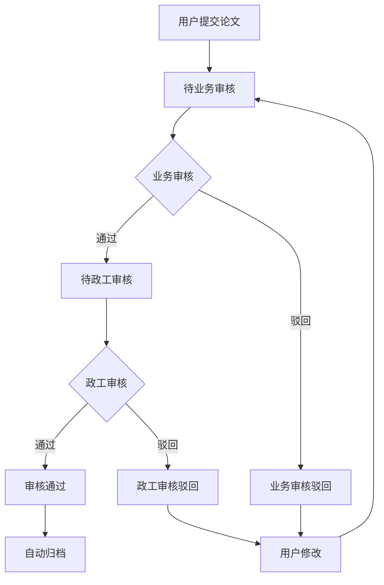

#### 3.3.2 审核时限管理

```go
package service

import (
    "time"
)

type ReviewDeadlineService struct {
    configService *SystemConfigService
}

// CalculateDeadline 计算审核截止日期
func (s *ReviewDeadlineService) CalculateDeadline(submitTime time.Time) time.Time {
    workDays := s.configService.GetReviewDeadlineDays() // 默认 3 个工作日
    return s.calculateWorkDaysLater(submitTime, workDays)
}

// calculateWorkDaysLater 计算 N 个工作日后的日期
func (s *ReviewDeadlineService) calculateWorkDaysLater(startTime time.Time, workDays int) time.Time {
    current := startTime
    addedDays := 0
    
    for addedDays < workDays {
        current = current.AddDate(0, 0, 1)
        if s.isWorkDay(current) {
            addedDays++
        }
    }
    
    return current
}

// isWorkDay 判断是否为工作日
func (s *ReviewDeadlineService) isWorkDay(date time.Time) bool {
    weekday := date.Weekday()
    return weekday != time.Saturday && weekday != time.Sunday
}

// IsOverdue 检查是否逾期
func (s *ReviewDeadlineService) IsOverdue(deadline time.Time) bool {
    return time.Now().After(deadline)
}
```

#### 3.3.3 审核服务

```go
package service

import (
    "context"
    "errors"
    "time"
    
    "biolitmanager/internal/model"
    "biolitmanager/internal/repository"
)

type ReviewService struct {
    reviewRepo  *repository.ReviewRepository
    paperRepo   *repository.PaperRepository
    deadlineSvc *ReviewDeadlineService
    notifySvc   *NotificationService
}

type ReviewRequest struct {
    Result  string `json:"result" binding:"required"` // approved, rejected
    Comment string `json:"comment"`
}

func (s *ReviewService) BusinessReview(ctx context.Context, paperID int64, req *ReviewRequest, reviewer *model.User) (*model.ReviewLogDTO, error) {
    // 校验：必须是业务审核员
    if reviewer.Role != string(model.RoleBusinessReviewer) {
        return nil, errors.New("无权限进行业务审核")
    }
    
    paper, err := s.paperRepo.FindByID(paperID)
    if err != nil {
        return nil, errors.New("论文不存在")
    }
    
    // 校验：必须是待业务审核状态
    if paper.Status != model.PaperStatusPendingBusiness {
        return nil, errors.New("无审核权限")
    }
    
    // 检查是否逾期
    deadline := s.deadlineSvc.CalculateDeadline(paper.SubmitTime)
    isOverdue := s.deadlineSvc.IsOverdue(deadline)
    
    // 保存审核记录
    reviewLog := &model.ReviewLog{
        PaperID:     paperID,
        ReviewType:  model.ReviewTypeBusiness,
        Result:      req.Result,
        Comment:     req.Comment,
        ReviewerID:  reviewer.ID,
        ReviewTime:  time.Now(),
        IPAddress:   getClientIP(ctx),
        IsOverdue:   isOverdue,
    }
    
    if err := s.reviewRepo.Create(reviewLog); err != nil {
        return nil, err
    }
    
    // 更新论文状态
    if req.Result == "approved" {
        paper.Status = model.PaperStatusPendingPolitical
        // 发送政工审核通知
        s.notifySvc.SendReviewNotification(paper, model.ReviewTypePolitical)
    } else {
        paper.Status = model.PaperStatusBusinessRejected
        // 发送驳回通知
        s.notifySvc.SendRejectionNotification(paper, reviewer, req.Comment)
    }
    s.paperRepo.Update(paper)
    
    return model.ToReviewLogDTO(reviewLog), nil
}

func (s *ReviewService) PoliticalReview(ctx context.Context, paperID int64, req *ReviewRequest, reviewer *model.User) (*model.ReviewLogDTO, error) {
    // 校验：必须是政工审核员
    if reviewer.Role != string(model.RolePoliticalReviewer) {
        return nil, errors.New("无权限进行政工审核")
    }
    
    paper, err := s.paperRepo.FindByID(paperID)
    if err != nil {
        return nil, errors.New("论文不存在")
    }
    
    // 校验：必须是待政工审核状态
    if paper.Status != model.PaperStatusPendingPolitical {
        return nil, errors.New("无审核权限")
    }
    
    // 检查是否逾期
    deadline := s.deadlineSvc.CalculateDeadline(paper.SubmitTime)
    isOverdue := s.deadlineSvc.IsOverdue(deadline)
    
    // 保存审核记录
    reviewLog := &model.ReviewLog{
        PaperID:     paperID,
        ReviewType:  model.ReviewTypePolitical,
        Result:      req.Result,
        Comment:     req.Comment,
        ReviewerID:  reviewer.ID,
        ReviewTime:  time.Now(),
        IPAddress:   getClientIP(ctx),
        IsOverdue:   isOverdue,
    }
    
    if err := s.reviewRepo.Create(reviewLog); err != nil {
        return nil, err
    }
    
    // 更新论文状态
    if req.Result == "approved" {
        paper.Status = model.PaperStatusApproved
        // 触发归档
        s.archiveService.Archive(paper)
    } else {
        paper.Status = model.PaperStatusPoliticalRejected
        // 发送驳回通知
        s.notifySvc.SendRejectionNotification(paper, reviewer, req.Comment)
    }
    s.paperRepo.Update(paper)
    
    return model.ToReviewLogDTO(reviewLog), nil
}
```

### 3.4 查询检索模块

#### 3.4.1 查询条件设计

```go
package model

type PaperQuery struct {
    PaperID      string     `form:"paper_id"`
    Title        string     `form:"title"`
    AuthorName   string     `form:"author_name"`
    JournalName  string     `form:"journal_name"`
    PublishDate  *DateRange `form:"publish_date"`
    DOI          string     `form:"doi"`
    PubMedID     string     `form:"pubmed_id"`
    ImpactFactor *NumberRange `form:"impact_factor"`
    Partition    string     `form:"partition"`
    IsSCI        *bool      `form:"is_sci"`
    IsEI         *bool      `form:"is_ei"`
    AuthorType   string     `form:"author_type"`
    ProjectID    int64      `form:"project_id"`
    ProjectCode  string     `form:"project_code"`
    Status       PaperStatus `form:"status"`
    SubmitterID  int64      `form:"submitter_id"`
    SortBy       string     `form:"sort_by"`
    SortOrder    string     `form:"sort_order"` // asc, desc
}

type DateRange struct {
    Start string `form:"start"`
    End   string `form:"end"`
}

type NumberRange struct {
    Min float64 `form:"min"`
    Max float64 `form:"max"`
}
```

#### 3.4.2 动态查询构建

```go
package repository

import (
    "biolitmanager/internal/model"
    "gorm.io/gorm"
)

func (r *PaperRepository) Search(query *model.PaperQuery, page, size int) (*model.PageResult, error) {
    db := r.db.Model(&model.Paper{})
    
    // 精确查询
    if query.PaperID != "" {
        db = db.Where("paper_id = ?", query.PaperID)
    }
    if query.DOI != "" {
        db = db.Where("doi = ?", query.DOI)
    }
    if query.PubMedID != "" {
        db = db.Where("pubmed_id = ?", query.PubMedID)
    }
    
    // 模糊查询
    if query.Title != "" {
        db = db.Where("title LIKE ?", "%"+query.Title+"%")
    }
    if query.JournalName != "" {
        db = db.Where("journal_name LIKE ?", "%"+query.JournalName+"%")
    }
    
    // 范围查询
    if query.PublishDate != nil {
        db = db.Where("publish_date BETWEEN ? AND ?", query.PublishDate.Start, query.PublishDate.End)
    }
    if query.ImpactFactor != nil {
        db = db.Where("impact_factor BETWEEN ? AND ?", query.ImpactFactor.Min, query.ImpactFactor.Max)
    }
    
    // 布尔查询
    if query.IsSCI != nil {
        db = db.Where("is_sci = ?", *query.IsSCI)
    }
    if query.IsEI != nil {
        db = db.Where("is_ei = ?", *query.IsEI)
    }
    
    // 状态查询（普通用户只能看审核通过的）
    if query.Status != "" {
        db = db.Where("status = ?", query.Status)
    } else {
        // 默认只显示审核通过的
        db = db.Where("status IN ?", []string{string(model.PaperStatusApproved), string(model.PaperStatusArchived)})
    }
    
    // 排序
    if query.SortBy != "" {
        order := "ASC"
        if query.SortOrder == "desc" {
            order = "DESC"
        }
        db = db.Order(query.SortBy + " " + order)
    }
    
    // 分页查询
    var total int64
    db.Count(&total)
    
    var papers []model.Paper
    offset := (page - 1) * size
    db.Limit(size).Offset(offset).Find(&papers)
    
    return &model.PageResult{
        List:  papers,
        Total: total,
        Page:  page,
        Size:  size,
    }, nil
}
```

### 3.5 归档管理模块

#### 3.5.1 归档编号生成

```go
package service

import (
    "fmt"
    "math/rand"
    "time"
)

type ArchiveService struct {
    archiveRepo *repository.ArchiveRepository
    paperRepo   *repository.PaperRepository
}

func (s *ArchiveService) Archive(paper *model.Paper) (*model.ArchiveDTO, error) {
    // 生成归档编号：年份 + 论文 ID + 随机 3 位
    year := time.Now().Year()
    paperID := paper.PaperID[1:] // 去掉 P 前缀
    randomNum := rand.New(rand.NewSource(time.Now().UnixNano())).Intn(1000)
    archiveNumber := fmt.Sprintf("%d%s%03d", year, paperID, randomNum)
    
    // 保存归档记录
    archive := &model.Archive{
        PaperID:       paper.ID,
        ArchiveNumber: archiveNumber,
        Status:        model.ArchiveStatusPublic,
    }
    
    if err := s.archiveRepo.Create(archive); err != nil {
        return nil, err
    }
    
    // 更新论文状态
    paper.Status = model.PaperStatusArchived
    s.paperRepo.Update(paper)
    
    return model.ToArchiveDTO(archive), nil
}
```

### 3.6 统计分析模块

#### 3.6.1 统计指标设计

```go
package model

type StatisticsDTO struct {
    // 基础统计
    TotalPapers      int64             `json:"total_papers"`
    YearStats        map[int]int64     `json:"year_stats"`
    TypeStats        map[string]int64  `json:"type_stats"`
    AvgImpactFactor  float64           `json:"avg_impact_factor"`
    TotalCitations   int64             `json:"total_citations"`
    TotalOtherCitations int64          `json:"total_other_citations"`
    
    // 作者统计
    AuthorStats      []AuthorStatDTO   `json:"author_stats"`
    
    // 课题统计
    ProjectStats     []ProjectStatDTO  `json:"project_stats"`
    
    // 部门统计
    DeptStats        []DepartmentStatDTO `json:"dept_stats"`
}
```

#### 3.6.2 统计服务

```go
package service

type StatsService struct {
    paperRepo *repository.PaperRepository
}

func (s *StatsService) GetBasicStats() (*model.StatisticsDTO, error) {
    stats := &model.StatisticsDTO{}
    
    // 论文总数
    total, err := s.paperRepo.CountApprovedPapers()
    if err != nil {
        return nil, err
    }
    stats.TotalPapers = total
    
    // 各年份数量
    yearStats, err := s.paperRepo.CountByYear()
    if err != nil {
        return nil, err
    }
    stats.YearStats = yearStats
    
    // 各收录类型数量
    typeStats := make(map[string]int64)
    sciCount, _ := s.paperRepo.CountByType("is_sci")
    eiCount, _ := s.paperRepo.CountByType("is_ei")
    coreCount, _ := s.paperRepo.CountByType("is_core")
    typeStats["SCI"] = sciCount
    typeStats["EI"] = eiCount
    typeStats["中文核心"] = coreCount
    stats.TypeStats = typeStats
    
    // 平均影响因子
    avgIF, err := s.paperRepo.AvgImpactFactor()
    if err != nil {
        return nil, err
    }
    stats.AvgImpactFactor = avgIF
    
    // 总引用次数
    totalCitations, _ := s.paperRepo.SumCitations()
    totalOtherCitations, _ := s.paperRepo.SumOtherCitations()
    stats.TotalCitations = totalCitations
    stats.TotalOtherCitations = totalOtherCitations
    
    return stats, nil
}
```

### 3.7 系统管理模块

#### 3.7.1 系统配置管理

```go
package model

type SystemConfig struct {
    ID          string    `gorm:"primaryKey"`
    ConfigValue string    `gorm:"type:text"`
    Description string    `gorm:"type:text"`
    Type        string    `gorm:"type:text"` // string, number, boolean
    UpdatedAt   time.Time `gorm:"autoUpdateTime"`
}
```

```go
package service

type SystemConfigService struct {
    configRepo *repository.SystemConfigRepository
    cache      *cache.MemoryCache
}

func (s *SystemConfigService) GetConfigValue(key string) (string, error) {
    // 先查缓存
    cacheKey := cache.CacheKeys{}.ConfigKey(key)
    if value, found := s.cache.Get(cacheKey); found {
        return value.(string), nil
    }
    
    // 查数据库
    config, err := s.configRepo.FindByID(key)
    if err != nil {
        return "", errors.New("配置不存在")
    }
    
    // 写入缓存
    s.cache.Set(cacheKey, config.ConfigValue, 1*time.Hour)
    
    return config.ConfigValue, nil
}

func (s *SystemConfigService) GetReviewDeadlineDays() int {
    value, err := s.GetConfigValue("review.deadline.days")
    if err != nil {
        return 3 // 默认 3 个工作日
    }
    days, _ := strconv.Atoi(value)
    return days
}

func (s *SystemConfigService) GetMaxFileSize() int64 {
    value, err := s.GetConfigValue("file.max.size")
    if err != nil {
        return 100 * 1024 * 1024 // 默认 100MB
    }
    size, _ := strconv.ParseInt(value, 10, 64)
    return size
}
```

### 3.8 消息通知模块

#### 3.8.1 通知服务

```go
package service

import (
    "gopkg.in/gomail.v2"
)

type NotificationService struct {
    notifyRepo *repository.NotificationRepository
    userRepo   *repository.UserRepository
    configSvc  *SystemConfigService
}

// SendReviewNotification 发送审核通知
func (s *NotificationService) SendReviewNotification(paper *model.Paper, reviewType model.ReviewType) {
    // 获取审核人员列表
    reviewers := s.getReviewersByType(reviewType)
    
    for _, reviewer := range reviewers {
        // 保存系统通知
        notification := &model.Notification{
            UserID:      reviewer.ID,
            Type:        model.NotificationTypeReviewStatus,
            Title:       "待审核通知",
            Content:     fmt.Sprintf("您有待审核的论文：%s，请及时处理。", paper.Title),
            SendMethod:  "both",
        }
        s.notifyRepo.Create(notification)
        
        // 发送邮件
        if s.shouldSendEmail(reviewType) {
            go s.sendEmail(
                reviewer.Email,
                "论文审核通知",
                s.buildReviewEmailContent(paper, reviewType),
            )
        }
    }
}

// SendRejectionNotification 发送驳回通知
func (s *NotificationService) SendRejectionNotification(paper *model.Paper, reviewer *model.User, comment string) {
    submitter, err := s.userRepo.FindByID(paper.SubmitterID)
    if err != nil {
        return
    }
    
    // 保存系统通知
    notification := &model.Notification{
        UserID:      submitter.ID,
        Type:        model.NotificationTypeReviewStatus,
        Title:       "审核驳回通知",
        Content:     fmt.Sprintf("您的论文《%s》被%s驳回，原因：%s", paper.Title, reviewer.Name, comment),
        SendMethod:  "both",
    }
    s.notifyRepo.Create(notification)
    
    // 发送邮件
    go s.sendEmail(
        submitter.Email,
        "论文审核驳回通知",
        s.buildRejectionEmailContent(paper, reviewer, comment),
    )
}

// sendEmail 发送邮件
func (s *NotificationService) sendEmail(to, subject, content string) {
    from := s.configSvc.GetConfigValue("mail.from")
    smtpHost := s.configSvc.GetConfigValue("mail.smtp.host")
    smtpPort, _ := strconv.Atoi(s.configSvc.GetConfigValue("mail.smtp.port"))
    smtpUser := s.configSvc.GetConfigValue("mail.smtp.user")
    smtpPass := s.configSvc.GetConfigValue("mail.smtp.password")
    
    m := gomail.NewMessage()
    m.SetHeader("From", from)
    m.SetHeader("To", to)
    m.SetHeader("Subject", subject)
    m.SetBody("text/plain", content)
    
    d := gomail.NewDialer(smtpHost, smtpPort, smtpUser, smtpPass)
    if err := d.DialAndSend(m); err != nil {
        log.Printf("发送邮件失败：%v", err)
    }
}
```

---

## 4. 接口设计

### 4.1 RESTful API 设计规范

#### 4.1.1 设计原则

1. **资源命名**：使用名词复数形式，小写，连字符分隔
   - ✅ `/api/papers`
   - ✅ `/api/review-logs`
   - ❌ `/api/getPapers`
   - ❌ `/api/paperList`

2. **HTTP 方法**：
   - `GET`：查询资源
   - `POST`：创建资源
   - `PUT`：更新资源（全量）
   - `PATCH`：更新资源（部分）
   - `DELETE`：删除资源

3. **响应格式**：
```json
{
  "code": "000000",
  "msg": "success",
  "data": {}
}
```

4. **分页格式**：
```json
{
  "code": "000000",
  "msg": "success",
  "data": {
    "list": [],
    "total": 100,
    "page": 1,
    "size": 20
  }
}
```

#### 4.1.2 错误码规范

| 错误码范围 | 模块 | 说明 |
|-----------|------|------|
| 000000 | 通用 | 成功 |
| 100xxx | 通用错误 | 系统异常、参数错误等 |
| 101xxx | 认证模块 | 登录、权限相关 |
| 102xxx | 论文模块 | 论文管理相关 |
| 103xxx | 审核模块 | 审核流程相关 |
| 104xxx | 文件模块 | 文件上传下载相关 |
| 105xxx | 检索模块 | 查询检索相关 |
| 106xxx | 统计模块 | 统计分析相关 |
| 107xxx | 系统模块 | 系统配置相关 |

### 4.2 核心 API 端点

#### 4.2.1 认证接口

| 方法 | 路径 | 描述 | 认证 |
|------|------|------|------|
| POST | `/api/auth/login` | 用户登录 | ✗ |
| POST | `/api/auth/logout` | 用户登出 | ✓ |
| POST | `/api/auth/refresh` | 刷新 Token | ✓ |
| GET | `/api/auth/me` | 获取当前用户信息 | ✓ |

**登录接口示例**：
```http
POST /api/auth/login
Content-Type: application/json

{
  "username": "admin",
  "password": "Password@123"
}

Response:
{
  "code": "000000",
  "msg": "success",
  "data": {
    "token": "eyJhbGciOiJIUzI1NiIsInR5cCI6IkpXVCJ9...",
    "user": {
      "id": 1,
      "username": "admin",
      "name": "管理员",
      "role": "admin",
      "permissions": ["paper:*", "review:*", "system:*"]
    }
  }
}
```

#### 4.2.2 论文接口

| 方法 | 路径 | 描述 | 认证 | 权限 |
|------|------|------|------|------|
| GET | `/api/papers` | 查询论文列表 | ✓ | paper:view |
| GET | `/api/papers/{id}` | 获取论文详情 | ✓ | paper:view |
| POST | `/api/papers` | 创建论文 | ✓ | paper:create |
| PUT | `/api/papers/{id}` | 更新论文 | ✓ | paper:edit |
| DELETE | `/api/papers/{id}` | 删除论文 | ✓ | paper:delete |
| POST | `/api/papers/{id}/submit` | 提交审核 | ✓ | paper:create |
| POST | `/api/papers/import` | 批量导入 | ✓ | paper:create |
| GET | `/api/papers/{id}/export` | 导出论文 | ✓ | paper:export |
| POST | `/api/papers/{id}/upload` | 上传附件 | ✓ | paper:create |

#### 4.2.3 审核接口

| 方法 | 路径 | 描述 | 认证 | 权限 |
|------|------|------|------|------|
| GET | `/api/reviews/pending` | 待审核列表 | ✓ | review:* |
| GET | `/api/reviews/{paperId}` | 获取审核记录 | ✓ | review:view |
| POST | `/api/reviews/business` | 业务审核 | ✓ | review:business |
| POST | `/api/reviews/political` | 政工审核 | ✓ | review:political |
| GET | `/api/reviews/logs` | 审核日志查询 | ✓ | review:view |

#### 4.2.4 检索接口

| 方法 | 路径 | 描述 | 认证 |
|------|------|------|------|
| POST | `/api/search/papers` | 论文检索 | ✓ |
| GET | `/api/search/journals` | 期刊搜索 | ✓ |
| GET | `/api/search/projects` | 课题搜索 | ✓ |
| GET | `/api/search/authors` | 作者搜索 | ✓ |

#### 4.2.5 统计接口

| 方法 | 路径 | 描述 | 认证 | 权限 |
|------|------|------|------|------|
| GET | `/api/stats/basic` | 基础统计 | ✓ | stats:view |
| GET | `/api/stats/by-author` | 按作者统计 | ✓ | stats:view |
| GET | `/api/stats/by-project` | 按课题统计 | ✓ | stats:view |
| GET | `/api/stats/by-department` | 按部门统计 | ✓ | stats:view |
| GET | `/api/stats/by-year` | 按年份统计 | ✓ | stats:view |
| GET | `/api/stats/export` | 导出统计 | ✓ | stats:export |

#### 4.2.6 系统接口

| 方法 | 路径 | 描述 | 认证 | 权限 |
|------|------|------|------|------|
| GET | `/api/users` | 用户列表 | ✓ | system:user:manage |
| POST | `/api/users` | 创建用户 | ✓ | system:user:manage |
| PUT | `/api/users/{id}` | 更新用户 | ✓ | system:user:manage |
| DELETE | `/api/users/{id}` | 删除用户 | ✓ | system:user:manage |
| GET | `/api/projects` | 课题列表 | ✓ | system:project:manage |
| POST | `/api/projects` | 创建课题 | ✓ | system:project:manage |
| GET | `/api/journals` | 期刊列表 | ✓ | system:journal:manage |
| GET | `/api/configs` | 系统配置 | ✓ | system:config:manage |
| PUT | `/api/configs/{key}` | 更新配置 | ✓ | system:config:manage |
| GET | `/api/logs` | 操作日志 | ✓ | system:log:view |

### 4.3 外部接口集成

#### 4.3.1 JCR 数据库对接

```go
package service

import (
    "encoding/json"
    "fmt"
    "net/http"
    "time"
)

type JCRService struct {
    httpClient  *http.Client
    configSvc   *SystemConfigService
}

type ImpactFactorData struct {
    ISSN        string  `json:"issn"`
    ImpactFactor float64 `json:"impact_factor"`
    Partition   string  `json:"partition"`
    Year        int     `json:"year"`
}

// GetImpactFactor 获取期刊影响因子
func (s *JCRService) GetImpactFactor(issn string) (*ImpactFactorData, error) {
    baseURL := s.configSvc.GetConfigValue("jcr.api.url")
    url := fmt.Sprintf("%s/impact-factor?issn=%s", baseURL, issn)
    
    resp, err := s.httpClient.Get(url)
    if err != nil {
        return nil, fmt.Errorf("获取 JCR 影响因子失败：%w", err)
    }
    defer resp.Body.Close()
    
    var jcrResp JCRResponse
    if err := json.NewDecoder(resp.Body).Decode(&jcrResp); err != nil {
        return nil, err
    }
    
    return &ImpactFactorData{
        ISSN:        issn,
        ImpactFactor: jcrResp.ImpactFactor,
        Partition:   jcrResp.Partition,
        Year:        jcrResp.Year,
    }, nil
}

// BatchUpdateImpactFactors 批量更新期刊影响因子
func (s *JCRService) BatchUpdateImpactFactors() {
    journals, _ := s.journalRepo.FindAll()
    
    for _, journal := range journals {
        data, err := s.GetImpactFactor(journal.PrintISSN)
        if err != nil {
            log.Printf("获取期刊 %s 影响因子失败：%v", journal.FullName, err)
            continue
        }
        
        journal.ImpactFactor = data.ImpactFactor
        journal.JCRPartition = data.Partition
        s.journalRepo.Update(journal)
    }
}
```

#### 4.3.2 Web of Science 对接

```go
package service

type WebOfScienceService struct {
    httpClient *http.Client
    apiKey     string
}

type CitationData struct {
    DOI               string `json:"doi"`
    TotalCitations    int64  `json:"total_citations"`
    OtherCitations    int64  `json:"other_citations"`
}

// GetCitationCount 获取论文引用次数
func (s *WebOfScienceService) GetCitationCount(doi string) (*CitationData, error) {
    url := fmt.Sprintf("https://api.wos.com/citations?doi=%s&apiKey=%s", doi, s.apiKey)
    
    resp, err := s.httpClient.Get(url)
    if err != nil {
        return nil, fmt.Errorf("获取 WoS 引用次数失败：%w", err)
    }
    defer resp.Body.Close()
    
    var wosResp WOSResponse
    if err := json.NewDecoder(resp.Body).Decode(&wosResp); err != nil {
        return nil, err
    }
    
    return &CitationData{
        DOI:            doi,
        TotalCitations: wosResp.TotalCitations,
        OtherCitations: wosResp.OtherCitations,
    }, nil
}

// BatchUpdateCitations 批量更新引用次数
func (s *WebOfScienceService) BatchUpdateCitations() {
    papers, _ := s.paperRepo.FindApprovedPapers()
    
    for _, paper := range papers {
        if paper.DOI == "" {
            continue
        }
        
        data, err := s.GetCitationCount(paper.DOI)
        if err != nil {
            log.Printf("获取论文 %s 引用次数失败：%v", paper.PaperID, err)
            continue
        }
        
        paper.CitationCount = data.TotalCitations
        paper.OtherCitationCount = data.OtherCitations
        s.paperRepo.Update(paper)
    }
}
```

---

## 5. 安全设计

### 5.1 认证机制

#### 5.1.1 密码安全

```go
package security

import (
    "golang.org/x/crypto/bcrypt"
    "regexp"
)

// HashPassword 密码哈希
func HashPassword(password string) (string, error) {
    // 使用 bcrypt，cost=12
    bytes, err := bcrypt.GenerateFromPassword([]byte(password), 12)
    return string(bytes), err
}

// CheckPassword 验证密码
func CheckPassword(password, hash string) bool {
    err := bcrypt.CompareHashAndPassword([]byte(hash), []byte(password))
    return err == nil
}

// PasswordValidator 密码复杂度校验
func ValidatePassword(password string) (bool, []string) {
    var messages []string
    
    if len(password) < 8 {
        messages = append(messages, "密码长度至少 8 位")
    }
    if !regexp.MustCompile(`[a-z]`).MatchString(password) {
        messages = append(messages, "必须包含小写字母")
    }
    if !regexp.MustCompile(`[A-Z]`).MatchString(password) {
        messages = append(messages, "必须包含大写字母")
    }
    if !regexp.MustCompile(`\d`).MatchString(password) {
        messages = append(messages, "必须包含数字")
    }
    if !regexp.MustCompile(`[@$!%*?&]`).MatchString(password) {
        messages = append(messages, "必须包含特殊字符")
    }
    
    return len(messages) == 0, messages
}
```

#### 5.1.2 JWT Token 安全

```go
package security

import (
    "time"
    "github.com/golang-jwt/jwt/v5"
)

var jwtSecret = []byte("your-secret-key-change-in-production")

// Claims JWT 声明
type Claims struct {
    UserID      int64    `json:"user_id"`
    Username    string   `json:"username"`
    Role        string   `json:"role"`
    Permissions []string `json:"permissions"`
    jwt.RegisteredClaims
}

// GenerateToken 生成 Token
func GenerateToken(user *model.User, permissions []string) (string, error) {
    claims := Claims{
        UserID:      user.ID,
        Username:    user.Username,
        Role:        user.Role,
        Permissions: permissions,
        RegisteredClaims: jwt.RegisteredClaims{
            ExpiresAt: jwt.NewNumericDate(time.Now().Add(2 * time.Hour)),
            IssuedAt:  jwt.NewNumericDate(time.Now()),
            Issuer:    "biolitmanager",
        },
    }
    
    token := jwt.NewWithClaims(jwt.SigningMethodHS512, claims)
    return token.SignedString(jwtSecret)
}

// ParseToken 验证 Token
func ParseToken(tokenString string) (*Claims, error) {
    token, err := jwt.ParseWithClaims(tokenString, &Claims{}, func(token *jwt.Token) (interface{}, error) {
        return jwtSecret, nil
    })
    
    if err != nil {
        return nil, err
    }
    
    if claims, ok := token.Claims.(*Claims); ok && token.Valid {
        return claims, nil
    }
    
    return nil, fmt.Errorf("invalid token")
}
```

### 5.2 授权机制（RBAC）

#### 5.2.1 权限中间件

```go
package middleware

import (
    "github.com/gin-gonic/gin"
    "biolitmanager/internal/security"
    "biolitmanager/pkg/response"
    "net/http"
)

// RequirePermission 权限中间件
func RequirePermission(permission security.Permission) gin.HandlerFunc {
    return func(c *gin.Context) {
        userInfo, exists := c.Get("user")
        if !exists {
            c.JSON(http.StatusForbidden, response.Error("100004", "无权限"))
            c.Abort()
            return
        }
        
        user := userInfo.(*model.UserInfo)
        
        // 超级管理员拥有所有权限
        if user.Role == string(security.RoleSuperAdmin) {
            c.Next()
            return
        }
        
        // 检查权限
        hasPermission := false
        for _, perm := range user.Permissions {
            if perm == string(permission) {
                hasPermission = true
                break
            }
            // 支持通配符
            if strings.HasSuffix(perm, ":*") {
                prefix := strings.TrimSuffix(perm, ":*")
                if strings.HasPrefix(string(permission), prefix) {
                    hasPermission = true
                    break
                }
            }
        }
        
        if !hasPermission {
            c.JSON(http.StatusForbidden, response.Error("100004", "无权限"))
            c.Abort()
            return
        }
        
        c.Next()
    }
}
```

### 5.3 数据加密

#### 5.3.1 敏感字段加密

```go
package utils

import (
    "crypto/aes"
    "crypto/cipher"
    "crypto/rand"
    "encoding/base64"
    "errors"
    "io"
)

var encryptionKey = []byte("your-32-byte-encryption-key-here")

// Encrypt 加密敏感数据
func Encrypt(plainText string) (string, error) {
    block, err := aes.NewCipher(encryptionKey)
    if err != nil {
        return "", err
    }
    
    gcm, err := cipher.NewGCM(block)
    if err != nil {
        return "", err
    }
    
    nonce := make([]byte, gcm.NonceSize())
    if _, err := io.ReadFull(rand.Reader, nonce); err != nil {
        return "", err
    }
    
    ciphertext := gcm.Seal(nonce, nonce, []byte(plainText), nil)
    return base64.StdEncoding.EncodeToString(ciphertext), nil
}

// Decrypt 解密敏感数据
func Decrypt(cipherText string) (string, error) {
    data, err := base64.StdEncoding.DecodeString(cipherText)
    if err != nil {
        return "", err
    }
    
    block, err := aes.NewCipher(encryptionKey)
    if err != nil {
        return "", err
    }
    
    gcm, err := cipher.NewGCM(block)
    if err != nil {
        return "", err
    }
    
    nonceSize := gcm.NonceSize()
    if len(data) < nonceSize {
        return "", errors.New("ciphertext too short")
    }
    
    nonce, ciphertext := data[:nonceSize], data[nonceSize:]
    plaintext, err := gcm.Open(nil, nonce, ciphertext, nil)
    if err != nil {
        return "", err
    }
    
    return string(plaintext), nil
}
```

### 5.4 审计日志

#### 5.4.1 操作日志中间件

```go
package middleware

import (
    "bytes"
    "io/ioutil"
    "time"
    
    "github.com/gin-gonic/gin"
    "biolitmanager/internal/repository"
)

// LoggerMiddleware 日志中间件
func LoggerMiddleware(logRepo *repository.OperationLogRepository) gin.HandlerFunc {
    return func(c *gin.Context) {
        startTime := time.Now()
        
        // 读取请求体
        var requestBody []byte
        if c.Request.Body != nil {
            requestBody, _ = ioutil.ReadAll(c.Request.Body)
            c.Request.Body = ioutil.NopCloser(bytes.NewBuffer(requestBody))
        }
        
        // 处理请求
        c.Next()
        
        // 计算耗时
        costTime := time.Since(startTime)
        
        // 获取用户信息
        var userID int64
        if user, exists := c.Get("user"); exists {
            userID = user.(*model.UserInfo).UserID
        }
        
        // 保存操作日志
        log := &model.OperationLog{
            UserID:         userID,
            OperationType:  c.Request.Method,
            Module:         getModuleFromPath(c.FullPath()),
            TargetID:       getTargetID(c.Params),
            OperationContent: string(requestBody),
            OperationResult:  getOperationResult(c.Writer.Status()),
            IPAddress:      c.ClientIP(),
            CostTime:       int64(costTime / time.Millisecond),
        }
        logRepo.Create(log)
    }
}
```

---

## 6. 部署架构

### 6.1 部署拓扑

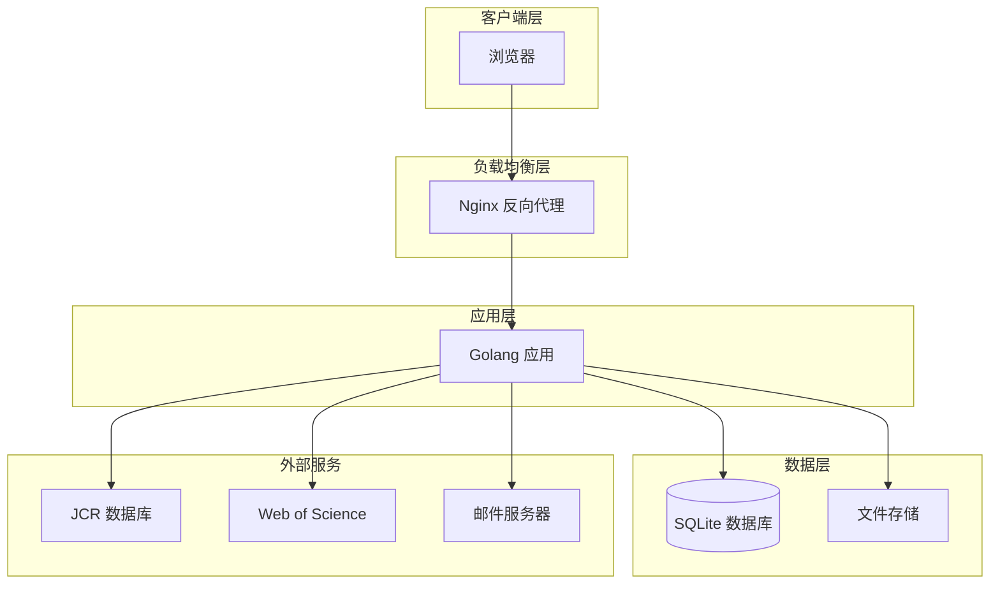

### 6.2 环境配置

#### 6.2.1 开发环境

```yaml
# config.dev.yaml
server:
  port: 8080
  mode: debug

database:
  path: ./data/biolitmanager.db
  
logging:
  level: debug
  format: console

jwt:
  secret: dev-secret-key-change-in-production
  expire: 2h
```

#### 6.2.2 生产环境

```yaml
# config.prod.yaml
server:
  port: 8080
  mode: release

database:
  path: /data/biolitmanager.db
  max_idle_conns: 10
  max_open_conns: 100
  
logging:
  level: info
  format: json
  file: /var/log/biolitmanager/application.log

jwt:
  secret: ${JWT_SECRET}
  expire: 2h

mail:
  from: ${MAIL_FROM}
  smtp:
    host: ${MAIL_SMTP_HOST}
    port: ${MAIL_SMTP_PORT}
    user: ${MAIL_SMTP_USER}
    password: ${MAIL_SMTP_PASSWORD}
```

### 6.3 备份策略

#### 6.3.1 数据库备份

```bash
#!/bin/bash
# 数据库备份脚本

BACKUP_DIR="/backup/database"
DATE=$(date +%Y%m%d_%H%M%S)
DB_PATH="/data/biolitmanager.db"

# 备份数据库文件
cp $DB_PATH "$BACKUP_DIR/biolitmanager_$DATE.db"

# 备份 WAL 文件（如果存在）
if [ -f "$DB_PATH-wal" ]; then
    cp "$DB_PATH-wal" "$BACKUP_DIR/biolitmanager_$DATE.db-wal"
fi

# 清理 7 天前的备份
find $BACKUP_DIR -name "*.db" -mtime +7 -delete

# 同步到异地备份服务器
rsync -avz $BACKUP_DIR/ backup@backup-server:/backup/biolitmanager/
```

#### 6.3.2 文件备份

```bash
#!/bin/bash
# 文件存储备份脚本

SOURCE_DIR="/data/uploads"
BACKUP_DIR="/backup/files"
DATE=$(date +%Y%m%d)

# 每日增量备份
rsync -av --delete $SOURCE_DIR/ $BACKUP_DIR/daily/$DATE/

# 每周全量备份（每周日）
if [ "$(date +%u)" -eq 7 ]; then
    tar -czf $BACKUP_DIR/weekly/backup_$DATE.tar.gz $SOURCE_DIR
fi
```

#### 6.3.3 数据恢复

```bash
#!/bin/bash
# 数据库恢复脚本

BACKUP_FILE=$1
DB_PATH="/data/biolitmanager.db"

if [ -z "$BACKUP_FILE" ]; then
    echo "Usage: $0 <backup_file>"
    exit 1
fi

# 停止应用
systemctl stop biolitmanager

# 恢复数据库
cp $BACKUP_FILE $DB_PATH

# 启动应用
systemctl start biolitmanager

echo "恢复完成"
```

---

## 7. C4 架构模型

### 7.1 Level 1 - System Context（系统上下文图）

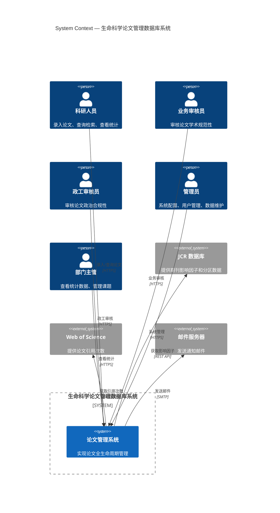

### 7.2 Level 2 - Container（容器图）

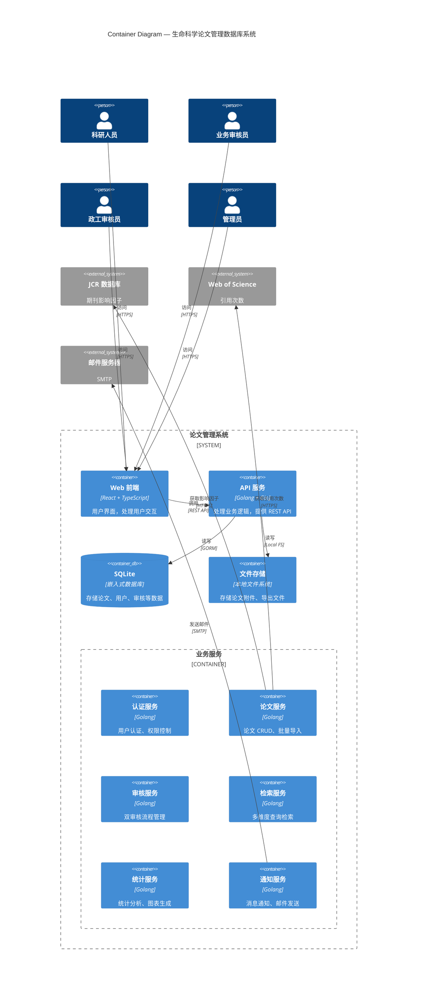

### 7.3 Level 3 - Component（组件图）

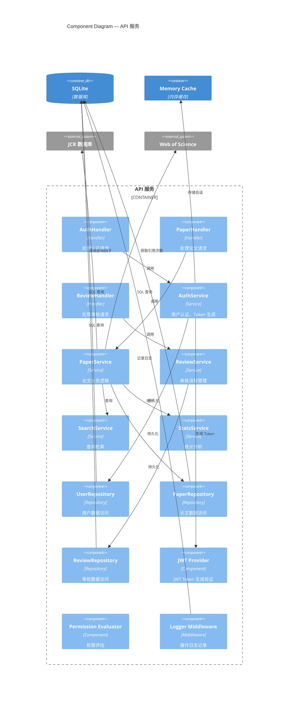

---

## 8. 架构决策记录 (ADR)

### ADR-001：后端语言选型

**日期**：2026-03-11  
**状态**：已采纳  
**决策者**：架构团队

#### 背景
需要为生命科学论文管理数据库系统选择合适的后端语言，考虑因素包括：
- 内网部署环境
- 50+ 并发用户
- 100 万 + 数据量
- 部署简单性
- 性能要求

#### 可选方案

**方案 A：Golang**
- 优点：高性能、编译为单一二进制、部署简单、内存占用低、并发模型优秀
- 缺点：泛型支持较晚、错误处理冗长

**方案 B：Java Spring Boot**
- 优点：企业级生态完善、性能稳定、人才储备充足
- 缺点：JVM 内存占用高、部署复杂、启动慢

**方案 C：Python FastAPI**
- 优点：开发效率高、学习曲线低
- 缺点：性能不如 Go/Java、GIL 限制并发

#### 决策
选择**方案 A：Golang**

#### 理由
1. **部署简单**：编译为单一二进制文件，无需 JVM 或 Python 环境
2. **性能优秀**：编译型语言，性能接近 C/C++，适合 100 万 + 数据量
3. **内存占用低**：适合内网服务器资源有限场景
4. **并发模型**：goroutine 轻量级并发，轻松处理 50+ 并发
5. **生态成熟**：Gin、GORM 等框架成熟，社区活跃

#### 后果
- 需要 Go 语言开发人员
- 获得更好的性能和部署体验

---

### ADR-002：数据库选型

**日期**：2026-03-11  
**状态**：已采纳  
**决策者**：架构团队

#### 背景
系统需要支持：
- 复杂多维度查询
- 事务处理
- 50+ 并发用户
- 100 万 + 数据量
- 零配置部署

#### 可选方案

**方案 A：SQLite**
- 优点：零配置、嵌入式、单文件、ACID 事务、部署简单
- 缺点：并发写入受限、不适合分布式场景

**方案 B：PostgreSQL**
- 优点：复杂查询性能优秀、功能强大、扩展性强
- 缺点：需要独立部署、配置复杂、运维成本高

#### 决策
选择**方案 A：SQLite**

#### 理由
1. **零配置**：无需安装数据库服务，降低部署复杂度
2. **单文件**：备份恢复简单，拷贝文件即可
3. **ACID 事务**：支持完整事务，数据安全性有保障
4. **性能足够**：通过 WAL 模式和连接池优化，50+ 并发完全胜任
5. **内网环境**：单机部署，无需分布式能力

#### 优化方案
1. 启用 WAL 模式提升并发性能
2. 配置连接池（max_open_conns=100）
3. 设置 busy_timeout=5000ms 避免锁等待
4. 定期 VACUUM 优化数据库文件

#### 后果
- 需要优化 SQLite 并发配置
- 获得极简的部署体验
- 后期如并发增长可迁移 PostgreSQL

---

### ADR-003：认证授权方案

**日期**：2026-03-11  
**状态**：已采纳  
**决策者**：架构团队

#### 背景
系统需要：
- 7 类角色权限隔离
- 会话管理
- 细粒度权限控制
- 无 Redis 场景

#### 可选方案

**方案 A：JWT + 内存缓存会话**
- 优点：无状态、JWT 自包含、内存缓存简单高效
- 缺点：单机限制、重启后会话丢失

**方案 B：纯 JWT（无会话存储）**
- 优点：完全无状态、最简单
- 缺点：无法主动失效 Token

#### 决策
选择**方案 A：JWT + 内存缓存会话**

#### 理由
1. **Token 自包含**：JWT 携带用户信息和权限，减少数据库查询
2. **会话管理**：内存缓存存储会话，支持主动失效（登出、锁定）
3. **高性能**：内存缓存读写性能极高，无网络开销
4. **简单可靠**：无额外依赖，降低运维复杂度

#### 实现方案
```go
// 内存缓存实现
type MemoryCache struct {
    items map[string]Item
    mu    sync.RWMutex
}

// 会话有效期 2 小时
cache.Set(sessionKey, userInfo, 2*time.Hour)
```

#### 后果
- 单机限制，不适合分布式部署
- 应用重启后会话丢失（用户需重新登录）
- 50+ 并发场景内存占用可接受

---

### ADR-004：文件存储方案

**日期**：2026-03-11  
**状态**：已采纳  
**决策者**：架构团队

#### 背景
系统需要：
- 存储 PDF 附件（最大 100MB）
- 内网环境
- 初期低成本

#### 可选方案

**方案 A：本地存储**
- 优点：实现简单、零成本、无需额外服务
- 缺点：不支持分布式、扩容需手动

**方案 B：MinIO 对象存储**
- 优点：支持分布式、S3 兼容、可扩展
- 缺点：需要额外部署维护

#### 决策
选择**方案 A：本地存储**

#### 理由
1. **简单可靠**：直接写入文件系统，无需额外服务
2. **零成本**：无需部署 MinIO 集群
3. **内网环境**：单机部署，无需分布式存储
4. **后期演进**：抽象文件存储接口，支持后期切换 MinIO

#### 后果
- 初期实现简单
- 需定期备份文件目录
- 后期可通过接口抽象无缝切换 MinIO

---

### ADR-005：无 Redis 缓存策略

**日期**：2026-03-11  
**状态**：已采纳  
**决策者**：架构团队

#### 背景
系统需要：
- 会话管理
- 热点数据缓存
- 无 Redis 依赖

#### 可选方案

**方案 A：内存缓存（Go Map + RWMutex）**
- 优点：零依赖、性能极高、实现简单
- 缺点：单机限制、重启后数据丢失

**方案 B：SQLite 缓存表**
- 优点：持久化、支持重启
- 缺点：性能不如内存、需定期清理

#### 决策
选择**方案 A：内存缓存**

#### 理由
1. **性能极致**：内存读写性能远超 Redis 网络访问
2. **零依赖**：无需部署 Redis 服务
3. **实现简单**：Go Map + sync.RWMutex 即可实现
4. **场景适合**：50+ 并发、单机部署，内存缓存完全胜任

#### 缓存策略
- 会话缓存：TTL 2 小时
- 用户信息：TTL 30 分钟
- 系统配置：TTL 1 小时
- 定期清理过期缓存

#### 后果
- 单机限制
- 重启后缓存丢失（会话需重新登录）
- 内存占用需监控（50+ 并发场景可接受）

---

### ADR-006：单体架构决策

**日期**：2026-03-11  
**状态**：已采纳  
**决策者**：架构团队

#### 背景
系统规模：
- 50+ 并发用户
- 8 个核心模块
- 初期快速上线需求

#### 可选方案

**方案 A：单体架构**
- 优点：开发简单、部署方便、调试容易
- 缺点：扩展性受限、耦合度高

**方案 B：微服务架构**
- 优点：独立部署、技术异构、易扩展
- 缺点：复杂度高、运维成本高

#### 决策
选择**方案 A：单体架构（模块化设计）**

#### 理由
1. **团队规模**：初期团队小，单体更易管理
2. **上线速度**：单体开发部署更快
3. **性能要求**：50 并发单体完全胜任
4. **演进性**：模块化设计支持后续拆分

#### 后果
- 初期开发效率高
- 后期可根据业务增长拆分
- 需保持模块间低耦合

---

## 附录

### 附录 A：术语表

| 术语 | 英文 | 说明 |
|------|------|------|
| RBAC | Role-Based Access Control | 基于角色的访问控制 |
| JWT | JSON Web Token | 开放标准，用于安全地在各方之间传输信息 |
| DOI | Digital Object Identifier | 数字对象唯一标识符 |
| JCR | Journal Citation Reports | 期刊引证报告 |
| WoS | Web of Science | 科学引文索引数据库 |
| SCI | Science Citation Index | 科学引文索引 |
| EI | Engineering Index | 工程索引 |
| ISSN | International Standard Serial Number | 国际标准连续出版物号 |
| WAL | Write-Ahead Logging | 预写式日志，SQLite 并发优化模式 |

### 附录 B：Go 语言项目结构参考

```
biolitmanager/
├─ cmd/
│  └─ server/
│     └─ main.go
├─ internal/
│  ├─ handler/
│  ├─ service/
│  ├─ repository/
│  ├─ model/
│  ├─ middleware/
│  ├─ config/
│  ├─ database/
│  ├─ cache/
│  ├─ security/
│  └─ utils/
├─ pkg/
│  ├─ logger/
│  └─ response/
├─ uploads/
├─ config.yaml
├─ go.mod
├─ go.sum
└─ Makefile
```

### 附录 C：参考资料

1. [Gin 官方文档](https://gin-gonic.com/docs/)
2. [GORM 官方文档](https://gorm.io/docs/)
3. [React 官方文档](https://react.dev/)
4. [C4 Model 官方文档](https://c4model.com/)
5. [SQLite 官方文档](https://www.sqlite.org/docs.html)

---

**文档结束**