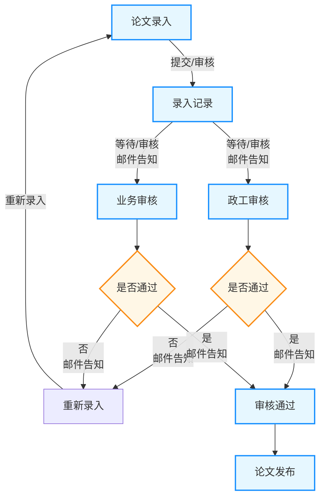

# 生命科学论文管理数据库系统需求文档

## 1. 文档概述

### 1.1 项目背景

本科学中心专注于生命科学领域，尤其以蛋白质相关研究为核心方向。随着科研实力的提升，团队发表的学术论文数量持续增长，论文相关的信息管理（包括查询、录入、审核、归档等）工作量日益繁重。为解决当前信息分散、管理效率低、追溯困难等问题，亟需建设一套标准化、系统化的论文管理数据库系统，实现论文全生命周期的规范化管理，为科研成果沉淀、学术影响力分析、项目验收等提供数据支撑。

### 1.2 项目目标

1. 建立统一的论文信息数据库，整合论文、作者、课题、人员等关联数据，确保信息的完整性、一致性和准确性。
2. 实现论文信息的便捷录入、智能查询、流程化审核、安全归档等核心功能，提升管理效率。
3. 规范审核流程，明确业务审核与政工审核的职责边界，确保论文信息公开的合规性。
4. 支持数据统计分析与导出，满足科研管理、成果申报等场景的使用需求。
5. 保障系统数据安全，提供精细化的权限控制，防止信息泄露或误操作。

### 1.3 适用范围

本系统适用于本科学中心所有从事生命科学（蛋白质方向）研究的科研人员、课题负责人、行政管理人员及审核人员，覆盖中心内所有已发表、待发表的学术论文（含 SCI、EI、CI、DI、中文核心等各类收录类型）的全生命周期管理。

## 2. 功能需求

### 2.1 数据录入模块

#### 2.1.1 论文信息录入

1. 支持科研人员（数据录入人员）手动录入论文的全部核心字段（详见 “数据字段规范”），字段类型需匹配（如日期型、数值型、布尔型、文本型、附件型等），并提供格式校验（如 DOI 号、ISSN 号、PubMedID 格式验证，日期格式统一为 “YYYY-MM-DD”，页码为数字区间等）。
2. 支持批量导入功能：允许通过模板 Excel 文件批量上传论文信息，系统自动校验数据格式，对不符合规范的数据标注错误原因，支持批量修正后重新导入。
3. 附件上传支持：论文全文（PDF 格式）、论文首页、期刊封面、审批件等附件需支持批量上传，单个附件大小限制不低于 50MB，支持断点续传。
4. 字段辅助填写：期刊相关信息（全称、简称、缩写、Print-ISSN、Online-ISSN）支持模糊搜索匹配（系统内置常用期刊数据库），减少手动录入错误；影响因子支持自动关联最新 JCR 分区数据（可选手动录入修正）；“论文分区” 支持根据期刊影响因子自动匹配（需提供分区标准配置功能）。
5. 录入进度保存：支持草稿保存功能，未完成录入的论文信息可暂存为草稿，后续可继续编辑提交。
6. 重复校验：录入时系统自动根据 “论文标题 + DOI 号” 或 “PubMedID” 校验是否为重复论文，若存在重复则提示用户并展示已存在的论文信息，避免重复录入。

#### 2.1.2 作者信息录入

1. 一篇论文支持关联多个作者，录入时可添加、删除、调整作者顺序，作者数量无上限（需与 “作者数量” 字段自动同步）。
2. 作者信息字段需完整录入（详见 “数据字段规范”），其中 “作者单位及部门” 需关联系统内已维护的人员单位 / 部门数据，支持下拉选择；“作者类型”“是否通讯作者”“是否共同通讯作者” 需明确勾选，且 “第一作者” 与 “共同第一作者” 不可同时勾选同一作者。
3. 支持从系统 “人员信息库” 中选择已有人员作为作者，自动填充姓名、单位、部门等基础信息，仅需补充作者类型、排名、通讯作者标识等论文专属信息，提升录入效率。

#### 2.1.3 课题信息录入

1. 一篇论文支持关联多个课题（需与 “是否单独一个课题组完成” 字段逻辑一致），可添加、删除关联课题。
2. 课题信息字段需完整录入（详见 “数据字段规范”），“项目类型”“项目来源”“项目级别” 支持下拉选择，选择 “其它” 时需手动录入具体内容并校验非空。
3. 支持从系统 “课题信息库” 中选择已有课题，自动填充课题名称、课题编号、项目类型等信息，仅需补充备注等额外信息。

#### 2.1.4 录入信息确认

1. 录入完成后，系统生成录入信息预览页面，展示论文、作者、课题的完整关联信息，供用户核对。
2. 用户确认无误后提交审核，提交后不可修改录入信息；若需修改，需在审核流程驳回后操作。
3. 系统自动记录数据录入人员、数据录入时间，不可手动修改。

### 2.2 审核管理模块

#### 2.2.1 审核流程规则

1. 论文信息提交后，需依次经过**业务审核**和**政工审核**，两项审核均通过后，论文信息方可公开并允许查询；任意一项审核不通过，论文信息退回至提交者，需修改后重新提交审核。
2. 审核时限：业务审核需在 x个工作日内完成，政工审核需在x 个工作日内完成；逾期未审核的，系统自动向审核人员发送提醒通知（邮件 + 系统消息）。
3. 审核状态同步：系统实时更新审核状态（待业务审核、业务审核中、待政工审核、政工审核中、审核通过、审核驳回），并向提交者推送状态变更通知（邮件 + 系统消息，根据 “业务审核是否邮件告知”“政工审核是否邮件告知” 字段配置）。
4. 流程图如下：

#### 2.2.2 业务审核功能

1. 审核人员权限：仅指定的业务审核人员可查看待审核的论文信息，进行审核操作。
2. 审核内容：重点审核论文信息的真实性、学术规范性（如作者排名、单位信息、课题关联关系、期刊信息、影响因子等是否准确）、附件完整性（如是否上传论文全文、审批件等）。
3. 审核操作：
   * 审核通过：点击 “通过” 按钮，系统记录业务审核状态（通过）、业务审核说明（可选填写）、业务审核日期、业务审核人员、业务审核 IP，论文自动进入政工审核环节。
   * 审核驳回：点击 “驳回” 按钮，需填写驳回原因（必填，支持富文本编辑），系统记录相关审核信息，论文退回至提交者，提交者收到驳回通知后可修改信息重新提交。

#### 2.2.3 政工审核功能

1. 审核人员权限：仅指定的政工审核人员可查看待政工审核的论文信息，进行审核操作。
2. 审核内容：重点审核论文信息的政治合规性、意识形态安全性（如摘要、论文标题中是否存在敏感内容，作者单位、课题来源是否符合相关规定等）。
3. 审核操作：
   * 审核通过：点击 “通过” 按钮，系统记录政工审核状态（通过）、政工审核说明（可选填写）、政工审核日期、政工审核人员、政工审核 IP，论文状态更新为 “审核通过”，进入公开归档环节。
   * 审核驳回：点击 “驳回” 按钮，需填写驳回原因（必填，支持富文本编辑），系统记录相关审核信息，论文退回至提交者，提交者收到驳回通知后可修改信息重新提交（重新提交后需再次经过业务审核和政工审核）。

#### 2.2.4 审核记录查询

1. 支持提交者、审核人员、管理员查询论文的完整审核记录，包括各审核环节的审核人员、审核时间、审核结果、审核说明、IP 地址等信息，记录不可修改、不可删除。

### 2.3 查询检索模块

#### 2.3.1 基础查询功能

1. 公开查询范围：仅审核通过的论文信息可被公开查询；未审核、审核驳回的论文仅提交者、审核人员、管理员可查看。
2. 查询条件：支持多维度组合查询，查询字段包括：论文 ID、论文标题（模糊查询）、作者姓名、期刊名称、正式出版日期（时间区间）、上线日期（时间区间）、DOI 号、PubMedID、影响因子（数值区间）、论文分区、是否 SCI/EI/CI/DI 论文、中文核心、课题名称、课题编号、数据录入人员、审核状态等。
3. 查询结果展示：默认展示论文 ID、论文标题、作者列表、期刊全称、正式出版日期、影响因子、论文分区、审核状态等关键信息，支持按 “正式出版日期”“影响因子”“引用次数” 等字段升序 / 降序排序。
4. 详情查看：点击查询结果中的论文，可查看论文、作者、课题的完整关联信息及附件（论文全文、首页等）。

#### 2.3.2 高级检索功能

1. 支持精准检索：如 DOI 号、PubMedID、Print-ISSN、Online-ISSN 等唯一标识字段的精确匹配查询。
2. 支持组合逻辑检索：查询条件可通过 “且 / 或 / 非” 逻辑组合，实现复杂查询需求（如 “2020-2025 年发表的 SCI 论文且影响因子≥5.0”）。
3. 支持作者类型检索：可筛选 “第一作者”“共同第一作者”“通讯作者” 等特定类型作者的论文。
4. 支持课题关联检索：可通过课题编号、项目类型、项目来源等字段，检索该课题关联的所有论文。

### 2.4 归档管理模块

#### 2.4.1 自动归档

1. 论文审核通过后，系统自动将其归档至 “已公开论文库”，归档信息包括论文完整数据、作者信息、课题信息、审核记录、附件等。
2. 归档时自动生成唯一的归档编号（规则：年份 + 论文 ID + 随机 3 位数字），作为论文归档的唯一标识。

#### 2.4.2 归档分类

1. 按发表年份分类：系统自动按 “正式出版日期” 的年份对归档论文进行分类，支持按年份快速筛选。
2. 按期刊收录类型分类：自动按 “是否 SCI/EI/CI/DI 论文”“中文核心” 等字段分类，如 SCI 论文库、EI 论文库、中文核心论文库等。
3. 按课题分类：自动按关联的课题编号、课题名称分类，支持通过课题快速定位所属论文。
4. 按作者分类：自动按作者姓名分类，支持查看单个作者的所有发表论文。

#### 2.4.3 归档修改与删除

1. 已归档的论文信息原则上不可修改，若确需修改（如引用次数更新、作者信息更正等），需由提交者提交修改申请，经原业务审核人员和政工审核人员二次审核通过后，方可修改，系统记录修改痕迹（修改人、修改时间、修改前内容、修改后内容）。
2. 已归档的论文不可删除，仅支持管理员在特殊情况下（如论文存在严重错误、违规等）将其设置为 “隐藏状态”，隐藏后不可公开查询，但历史数据仍保留在系统中，可追溯。

### 2.5 数据统计与导出模块

#### 2.5.1 统计分析功能

1. 基础统计：系统自动统计论文总数、各年份发表数量、各收录类型（SCI/EI 等）论文数量、各期刊发表数量、平均影响因子、总引用次数、总他引次数等核心指标。
2. 维度统计：
   * 按作者统计：单个作者的发表论文数量、第一作者论文数量、通讯作者论文数量、平均影响因子、总引用次数等。
   * 按课题统计：单个课题关联的论文数量、高影响因子（如≥5.0）论文数量、SCI 收录论文数量等。
   * 按单位 / 部门统计：各单位、部门的发表论文数量、学术影响力（总影响因子、总引用次数）等。
3. 统计可视化：支持通过柱状图、折线图、饼图、表格等形式展示统计结果，支持图表导出（PNG、PDF 格式）。

#### 2.5.2 数据导出功能

1. 支持查询结果导出：可将查询到的论文列表数据导出为 Excel 格式，导出字段可自定义选择（默认导出关键字段，支持勾选需要导出的字段）。
2. 支持单篇论文完整信息导出：可将单篇论文的完整数据（含作者、课题信息）及审核记录导出为 Word/PDF 格式，用于存档或申报材料。
3. 支持统计结果导出：可将统计分析结果（图表 + 数据表格）导出为 Excel、PDF 格式。
4. 导出权限控制：仅具有 “导出权限” 的用户（如管理员、科研管理人员）可导出数据，普通科研人员仅可导出自己提交的论文信息。

### 2.6 系统管理模块

#### 2.6.1 人员管理

1. 支持管理员维护系统用户信息（字段详见 “数据字段规范 - 人员信息”），包括添加、修改、禁用用户，分配用户角色。
2. 角色定义：系统默认角色包括 “科研人员”（数据录入、查询自己提交的论文、查看公开论文）、“业务审核人员”（业务审核、查询待审核及已审核论文）、“政工审核人员”（政工审核、查询待审核及已审核论文）、“科研管理人员”（查询所有论文、统计分析、数据导出）、“系统管理员”（全权限，含人员管理、角色配置、系统参数设置等）。
3. 密码管理：支持用户自行修改密码，管理员可重置用户密码（重置后为初始密码，用户首次登录需强制修改）。

#### 2.6.2 课题信息管理

1. 支持管理员或课题负责人维护课题信息库（字段详见 “数据字段规范 - 课题信息”），包括课题的添加、修改、删除（未关联论文的课题可删除，已关联论文的课题仅可修改基本信息，不可删除）。
2. 课题信息审核：新增或修改的课题信息需经科研管理人员审核通过后，方可在论文录入时被选择关联。

#### 2.6.3 期刊信息管理

1. 系统内置常用学术期刊数据库，支持管理员维护期刊信息（期刊全称、简称、缩写、Print-ISSN、Online-ISSN、JCR 分区标准、影响因子更新等）。
2. 支持定期更新期刊影响因子和分区数据（手动上传更新或对接第三方数据库自动更新），确保数据准确性。

#### 2.6.4 系统参数配置

1. 支持管理员配置系统关键参数，如：附件大小限制、审核时限、影响因子确认规则、论文分区标准、邮件通知模板、重复校验规则等。
2. 支持配置数据备份策略（自动备份频率：每日 / 每周；备份保留时长：至少 1 年）。

#### 2.6.5 日志管理

1. 系统自动记录所有操作日志，包括用户登录日志（登录时间、登录 IP、登录状态）、数据操作日志（录入、修改、删除、导出等操作的操作人员、操作时间、操作内容、操作结果）、审核日志（审核环节的所有操作记录）。
2. 日志查询：支持管理员按操作人员、操作时间、操作类型等字段查询日志，日志不可修改、不可删除，保留时长至少 3 年。

### 2.7 消息通知模块

1. 通知类型：包括审核状态变更通知（提交、驳回、通过）、审核时限提醒、密码重置通知、系统更新通知等。
2. 通知方式：支持系统内消息、邮件通知两种方式，其中 “业务审核是否邮件告知”“政工审核是否邮件告知” 可由提交者在录入论文时配置，其他通知默认同时发送系统消息和邮件。
3. 通知内容：需明确包含论文标题、审核环节、审核结果、操作指引（如驳回后修改重新提交的路径）等关键信息。

## 3. 数据字段规范

### 3.1 论文信息字段

|  |  |  |  |
| --- | --- | --- | --- |
| 字段名称 | 字段类型 | 是否必填 | 备注说明 |
| 论文 ID | 字符串（唯一） | 是 | 系统自动生成，规则：P + 年份 + 6 位自增数（如 P2025000001） |
| 论文标题 | 文本 | 是 | 需与发表论文标题完全一致，支持中英文 |
| 作者列表 | 文本 | 是 | 按发表顺序填写，作者间用 “，” 分隔 |
| 是否第一作者 | 布尔型（是 / 否） | 是 | 指本中心作者是否为第一作者 |
| 是否共同第一作者 | 布尔型（是 / 否） | 是 | 与 “是否第一作者” 互斥（仅可勾选一个） |
| 作者单位列表 | 文本 | 是 | 按作者顺序对应填写单位，单位间用 “；” 分隔 |
| 第一单位 | 文本 | 是 | 需与发表论文的第一单位一致 |
| 第一单位的部门 | 文本 | 是 | 第一单位所属部门，无则填写 “无” |
| 本单位是否第一单位 | 布尔型（是 / 否） | 是 | 指本科学中心是否为第一单位 |
| 期刊全称 | 文本 | 是 | 需填写期刊官方全称 |
| 期刊简称 | 文本 | 否 | 期刊常用简称 |
| 期刊缩写 | 文本 | 否 | 按 ISO 4 缩写规则填写（如无则按期刊官方缩写） |
| 正式出版日期 | 日期型（YYYY-MM-DD） | 是 | 以期刊印刷版出版日期为准，无则填写上线日期 |
| 上线日期 | 日期型（YYYY-MM-DD） | 是 | 网络首发日期（如无正式出版日期则为必填） |
| 卷 | 文本 | 否 | 无则填写 “无” |
| 期 | 文本 | 否 | 无则填写 “无” |
| 起始页 | 数值型 | 否 | 无则填写 “0” |
| 终止页 | 数值型 | 否 | 无则填写 “0” |
| DOI 号 | 文本 | 否 | 格式校验（需包含 “10.” 开头，符合 DOI 标准格式） |
| PubMedID | 文本 | 否 | 仅 PubMed 收录论文填写 |
| 影响因子 | 数值型（保留 2 位小数） | 否 | 以最新 JCR 报告为准 |
| 暂代影响因子 | 数值型（保留 2 位小数） | 否 | 暂无正式影响因子时填写暂代值 |
| 影响因子确认 | 布尔型（是 / 否） | 是 | 确认影响因子是否准确 |
| 摘要 | 长文本 | 是 | 需与发表论文摘要一致，支持中英文 |
| 是否 SCI 论文 | 布尔型（是 / 否） | 是 |  |
| 是否 EI 论文 | 布尔型（是 / 否） | 是 |  |
| 是否 CI 论文 | 布尔型（是 / 否） | 是 |  |
| 是否 DI 论文 | 布尔型（是 / 否） | 是 |  |
| 语言 | 文本 | 是 | 可选值：中文、英文、其他（填写具体语言） |
| 中文核心 | 布尔型（是 / 否） | 是 | 是否为中文核心期刊论文 |
| 论文分区 | 文本 | 否 | 可选值：1 区、2 区、3 区、4 区（按 JCR 分区标准），非 SCI 论文填写 “无” |
| 论文全文 | 附件（PDF） | 是 | 需上传清晰完整的最终发表版本 |
| 论文首页 | 附件（PDF/JPG） | 是 | 期刊发表论文的首页扫描件或电子版 |
| 刊发论文期刊封面 | 附件（PDF/JPG） | 否 | 该期期刊的封面图片 |
| 是否最终论文 | 布尔型（是 / 否） | 是 | 是否为最终发表的正式版本 |
| 引用次数 | 数值型 | 否 | 初始为 0，支持手动更新或对接 Web of Science 等数据库自动更新 |
| 他引次数 | 数值型 | 否 | 初始为 0，支持手动更新或对接 Web of Science 等数据库自动更新 |
| 引用查询时间 | 日期型（YYYY-MM-DD） | 否 | 上次更新引用次数的时间 |
| 最后修改时间 | 日期时间型（YYYY-MM-DD HH:MM:SS） | 是 | 系统自动记录，不可手动修改 |
| 审批件 | 附件（PDF） | 是 | 论文发表前的内部审批文件扫描件 |
| 备注（论文） | 长文本 | 否 | 填写其他需补充的论文相关信息 |
| Print-ISSN | 文本 | 否 | 印刷版 ISSN 号，格式校验（8 位数字，含分隔符，如 1234-5678） |
| Online-ISSN | 文本 | 否 | 网络版 ISSN 号，格式校验同上 |
| 业务审核状态 | 文本 | 是 | 系统自动更新，可选值：待审核、审核通过、审核驳回 |
| 业务审核说明 | 长文本 | 否 | 审核人员填写的审核意见或驳回原因 |
| 业务审核日期 | 日期时间型（YYYY-MM-DD HH:MM:SS） | 否 | 系统自动记录 |
| 业务审核人员 | 文本 | 否 | 系统自动关联审核人员姓名 |
| 业务审核 IP | 文本 | 否 | 系统自动记录审核时的 IP 地址 |
| 政工审核状态 | 文本 | 是 | 系统自动更新，可选值：待审核、审核通过、审核驳回、未进入 |
| 政工审核说明 | 长文本 | 否 | 审核人员填写的审核意见或驳回原因 |
| 政工审核日期 | 日期时间型（YYYY-MM-DD HH:MM:SS） | 否 | 系统自动记录 |
| 政工审核人员 | 文本 | 否 | 系统自动关联审核人员姓名 |
| 政工审核 IP | 文本 | 否 | 系统自动记录审核时的 IP 地址 |
| 作者数量 | 数值型 | 是 | 系统自动根据作者列表统计，不可手动修改 |
| 单位数量 | 数值型 | 是 | 系统自动根据作者单位列表统计（去重），不可手动修改 |
| 是否单独一个课题组完成 | 布尔型（是 / 否） | 是 |  |
| 是否单独一个单位完成 | 布尔型（是 / 否） | 是 |  |
| 审核状态 | 文本 | 是 | 系统自动更新，可选值：待审核、审核中、审核通过、审核驳回 |
| 业务审核是否邮件告知 | 布尔型（是 / 否） | 是 | 提交者选择是否接收业务审核结果邮件通知 |
| 政工审核是否邮件告知 | 布尔型（是 / 否） | 是 | 提交者选择是否接收政工审核结果邮件通知 |
| 数据录入人员 | 文本 | 是 | 系统自动关联录入人员姓名，不可手动修改 |
| 数据录入时间 | 日期时间型（YYYY-MM-DD HH:MM:SS） | 是 | 系统自动记录，不可手动修改 |

### 3.2 作者信息字段

|  |  |  |  |
| --- | --- | --- | --- |
| 字段名称 | 字段类型 | 是否必填 | 备注说明 |
| 作者姓名 | 文本 | 是 | 需与发表论文作者姓名一致 |
| 作者类型 | 文本 | 是 | 可选值：第一作者、共同第一作者、参与作者 |
| 是否通讯作者 | 布尔型（是 / 否） | 是 |  |
| 是否共同通讯作者 | 布尔型（是 / 否） | 是 | 与 “是否通讯作者” 互斥（仅可勾选一个） |
| 作者排名 | 数值型 | 是 | 按发表论文的作者顺序填写（1、2、3...） |
| 作者单位及部门 | 文本 | 是 | 填写作者所属单位及具体部门 |
| 单位地址 | 文本 | 否 | 作者单位的详细地址 |
| 备注（作者） | 长文本 | 否 | 填写作者相关补充信息（如校外作者合作单位等） |

### 3.3 课题信息字段

|  |  |  |  |
| --- | --- | --- | --- |
| 字段名称 | 字段类型 | 是否必填 | 备注说明 |
| 课题名称 | 文本 | 是 | 需与课题立项通知书一致 |
| 课题编号 | 文本 | 是 | 需填写完整的课题编号（如国家自然科学基金编号：31230020） |
| 项目类型 | 文本 | 是 | 可选值：重点、面上、青年、其它（需填写具体类型） |
| 项目来源 | 文本 | 是 | 可选值：国家自然科学基金、国家重点研发计划、国家科技支撑计划、其它（需填写具体来源） |
| 项目级别 | 文本 | 是 | 可选值：中央财政科技计划、省部级科技计划、军队科技计划、其它（需填写具体级别） |
| 备注（课题） | 长文本 | 否 | 填写课题相关补充信息（如课题起止时间、合作单位等） |

### 3.4 人员信息字段

|  |  |  |  |
| --- | --- | --- | --- |
| 字段名称 | 字段类型 | 是否必填 | 备注说明 |
| 姓名 | 文本 | 是 | 与身份证姓名一致 |
| 身份类别 | 文本 | 是 | 可选值：科研人员、业务审核人员、政工审核人员、科研管理人员、系统管理员、其他 |
| 身份证号 | 文本 | 是 | 格式校验（18 位身份证号，支持末位 X） |
| 电话号码 | 文本 | 否 | 固定电话，格式：区号 - 电话号码（如 010-12345678） |
| 手机号码 | 文本 | 是 | 格式校验（11 位手机号） |
| 邮箱地址 | 文本 | 是 | 格式校验（含 @及域名后缀） |
| 单位 | 文本 | 是 | 填写所属单位全称 |
| 部门 | 文本 | 是 | 填写所属具体部门 |

## 4. 非功能需求

### 4.1 性能需求

1. 响应时间：单个页面加载时间≤1 秒，简单查询（1-2 个条件）响应时间≤1 秒，复杂查询（5 个以上条件）响应时间≤2 秒，文件上传（50MB 以内）响应时间≤5 秒。
2. 并发用户：支持至少 50 名用户同时在线操作，至少 10 名用户同时进行数据录入或查询操作，无明显卡顿。
3. 数据存储：支持至少 1000000 条论文数据及相关附件存储，单个附件最大支持 100MB。
4. 数据处理：批量导入时，单次支持至少 100 条论文数据导入，导入时间≤5 分钟。

### 4.2 安全需求

1. 身份认证：用户登录需输入用户名 + 密码，支持密码复杂度校验（至少 8 位，含大小写字母、数字、特殊字符），连续 5 次登录失败则锁定账号 1 小时。
2. 权限控制：基于角色的权限管理（RBAC），不同角色仅能访问和操作对应权限范围内的功能和数据，防止越权操作。系统设 7 类角色（超级管理员、管理员、部门主管、课题组长、业务审核员、政工审核员、普通用户），权责分级如下：
   * 超级管理员：全系统最高权限，可访问所有菜单（含账户、角色、部门、论文、数据字典、网站设置等），管理全量账户及系统配置；同时具备业务审核与政工审核的最终复核权限（可驳回任意审核环节的结果）。​
   * 管理员：协助管理课题组 / 部门及用户，负责数据字典配置，可访问账户、部门、论文、数据字典管理菜单，无角色管理、网站设置及审核权限。​
   * 部门主管：仅管理本部门成员账户，可访问本部门账户管理、论文管理、个人资料菜单，无系统配置类权限及审核权限。​
   * 课题组长：仅管理本课题组成员账户，可访问本课题组账户管理、论文管理、个人资料菜单，无系统配置类权限及审核权限；仅负责初步校验本课题组提交论文的信息完整性（非审核决策，仅标注补充意见）。​
   * 业务审核员（专职）：独立审核角色，无账户管理及系统配置权限；负责全系统论文的学术真实性审核（如作者信息、课题关联、期刊合规性、数据准确性、附件完整性等），拥有审核通过、驳回、填写审核说明的操作权限；仅可访问论文管理（审核相关模块）、个人资料管理菜单。​
   * 政工审核员（专职）：独立审核角色，无账户管理及系统配置权限；负责全系统论文的政治合规性审核（如敏感内容、意识形态合规、作者单位合规等），拥有审核通过、驳回、填写审核说明的操作权限；仅可访问论文管理（审核相关模块）、个人资料管理菜单。​
   * 普通用户：仅可提交论文信息、管理个人资料，仅访问论文管理（提交 / 查看个人论文）、个人资料管理菜单，无任何管理及审核权限。

核心控制规则：① 无权限菜单默认隐藏，杜绝越权访问；② 账户管理权限按角色层级隔离，低层级不可管理高层级，且仅限自身负责范围（部门 / 课题组）；③ 系统级配置权限仅开放给超级管理员及管理员；④ 个人资料仅本人可编辑，其他角色仅获授权后可管理对应范围账户信息；⑤ 审核权限独立专属：业务审核由专职业务审核员负责，政工审核由专职政工审核员负责，二者无交叉权限，普通用户及其他管理角色无审核权限，超级管理员拥有复核权限，确保审核流程独立、规范可追溯；⑥ 所有账户操作（新增 / 删除 / 修改）及审核操作（通过 / 驳回）均留存操作日志（含操作人、时间、IP、意见），便于审计排查；⑦ 业务审核员与政工审核员账户由超级管理员统一创建、分配权限，不可自行新增或修改权限。

1. 数据安全：
   * 敏感数据（如身份证号、电话号码）存储时需加密处理，传输过程采用 HTTPS 协议加密。
   * 系统自动定期备份数据（每日增量备份，每周全量备份），备份数据存储在异地服务器，防止数据丢失。
   * 支持数据恢复功能，可恢复至最近 7 天内的任意备份点。
2. 防攻击：系统需具备防 SQL 注入、XSS 跨站脚本攻击、CSRF 跨站请求伪造等常见网络攻击的能力，定期进行安全漏洞扫描。

### 4.3 易用性需求

1. 界面设计：采用简洁、直观的 UI 设计，操作流程清晰，符合科研人员的使用习惯；核心功能（录入、查询、审核）入口明显，减少操作步骤。
2. 引导提示：关键操作环节（如录入字段校验、审核驳回原因填写）提供明确的提示信息，帮助用户快速完成操作。
3. 兼容性：支持主流浏览器（Chrome、Edge、Firefox、Safari）的最新版本及前两个版本，适配 PC 端常用分辨率（1920×1080、1366×768 等），不支持移动端。
4. 帮助文档：系统内置在线帮助文档，包含功能操作指南、常见问题解答（FAQ），帮助用户快速上手使用。

### 4.4 可扩展性需求

1. 功能扩展：系统架构需具备灵活性，支持后续新增功能模块（如论文成果转化管理、专利关联管理等），无需大规模重构。
2. 数据字段扩展：支持新增论文、作者、课题、人员等数据的字段，可配置字段是否必填、字段类型、校验规则等。
3. 接口扩展：预留与第三方系统的对接接口（如科研管理平台、期刊数据库、成果申报系统等），支持数据同步与共享。

### 4.5 可靠性需求

1. 系统稳定性：全年可用率≥99.9%；故障发生后，恢复时间≤1 小时。
2. 数据一致性：系统运行过程中需保证数据的完整性和一致性，避免出现数据丢失、重复、错误等问题。
3. 日志可靠性：操作日志、审核日志、系统日志需准确记录，不可篡改，确保数据追溯的有效性。

## 5. 其他需求

### 5.1 培训需求

系统上线后，需为不同角色的用户提供操作培训（包括线上教程、线下培训会议），确保用户能够熟练使用系统功能。

### 5.2 维护需求

提供系统运维手册，明确日常维护流程、常见故障处理方法；技术支持团队需在工作时间内（9:00-18:00）提供技术支持，响应时间≤2 小时。

### 5.3 合规需求

系统建设需符合国家相关法律法规及本科学中心的内部管理制度，确保论文信息管理的合规性，特别是涉及涉密信息的论文需具备相应的保密措施（如隐藏敏感字段、限制访问权限等）。